# PocApp — Microservice Migration POC

A small-but-realistic proof of concept showing **how to migrate a monolithic ASP.NET Core MVC app to a microservices + React micro-frontend architecture without a big-bang rewrite** — and how to add cross-cutting features (SignalR real-time, dedicated auth service) on top of that without modifying the monolith.

The legacy app and the new stack run side-by-side behind a single URL. Users sign in **once** at MVC's existing login form (or the auth service) and seamlessly move between the legacy MVC UI and the new React UI — same data, same navbar, same calendar, same live shared stopwatch. The two UIs are visually indistinguishable; the URL bar is the only tell.

---

## What's inside

```
POC/
├── PocApp.sln                   ← solution rolling up all .NET projects
├── global.json                  ← pins the .NET 8 LTS SDK
│
├── PocApp/                      ← ❶ legacy ASP.NET Core MVC monolith — UNCHANGED
│   │                              (Users, Projects, Tasks, ASP.NET Identity).
│   │                              Carrier-grade strangler-fig rule: the new
│   │                              services here add features WITHOUT requiring
│   │                              code changes in this project.
│   ├── Controllers/             MVC controllers + AuthController (cookie → JWT
│   │                              + /api/auth/me + /api/auth/logout — used by
│   │                              Auth.Api as the cookie-validation trampoline)
│   ├── Models/                  ApplicationUser, Project, TaskItem
│   ├── Views/                   Razor views, _Layout.cshtml (master page)
│   ├── ViewComponents/          CalendarViewComponent
│   ├── Hubs/                    TimerHub + TimerState + TimerBroadcastService
│   ├── Data/                    ApplicationDbContext + migrations + seeder
│   ├── Areas/Identity/          scaffolded Login/Register Razor pages
│   ├── wwwroot/css/             site.css + calendar.css + timer.css
│   ├── wwwroot/js/              site.js + timer-widget.js (SignalR client)
│   └── app.db                   SQLite database (created on first run)
│
├── Services/
│   ├── Auth.Api/                ← ❷ NEW dedicated auth microservice (Option 2)
│   │   ├── Program.cs           POST /api/auth/login (creds → JWT)
│   │   │                        POST /api/auth/exchange (cookie → JWT,
│   │   │                          via trampoline to MVC)
│   │   │                        POST /api/auth/refresh (JWT → JWT)
│   │   │                        POST /api/auth/logout (clears MVC cookie too)
│   │   │                        GET  /api/auth/me
│   │   ├── Models/User.cs       Read-only mapping over AspNetUsers
│   │   ├── Data/                AuthDbContext — shared SQLite, read-only
│   │   └── Contracts/           LoginRequest, TokenResponse, AuthUserDto
│   │
│   └── Projects.Api/            ← ❸ Project domain microservice
│       ├── Program.cs           Minimal API + JWT bearer auth
│       │                          GET/POST/PUT/DELETE /api/projects
│       │                          GET /api/owners, GET /api/calendar
│       ├── Models/              Project + read-only OwnerView/TaskRow
│       ├── Data/                ProjectsDbContext (shares app.db read-only)
│       └── Contracts/           DTOs
│
├── Gateway/
│   └── PocApp.Gateway/          ← ❹ YARP reverse proxy (single front door)
│       └── appsettings.json     route table — the migration cutover lives here
│
└── Frontends/
    └── projects-mfe/            ← ❺ React + TypeScript micro-frontend
        ├── vite.config.ts       base: '/projects/new/' + HMR through gateway
        └── src/
            ├── api/             axios client + bearer interceptor
            ├── auth/            AuthProvider — bootstrap tries cookie exchange,
            │                    falls through to MVC login redirect
            ├── realtime/        useTimer hook (SignalR client for /hubs/timer)
            ├── components/      AppShell (mirrors _Layout.cshtml exactly),
            │                    Calendar (mirrors MVC partial), TimerWidget
            └── pages/           ProjectsList / Detail / Form (CRUD)
```

---

## Architecture at a glance

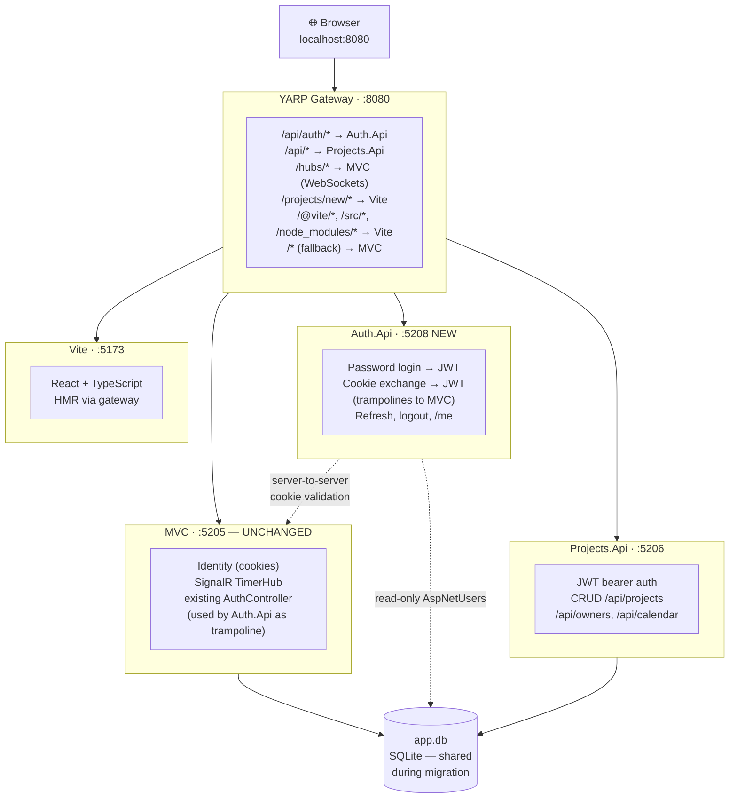
```mermaid
flowchart TB
    Browser["🌐 Browser<br/>localhost:8080"]

    subgraph Gateway["YARP Gateway · :8080"]
        direction TB
        Routes["/api/auth/* → Auth.Api<br/>/api/* → Projects.Api<br/>/hubs/* → MVC (WebSockets)<br/>/projects/new/* → Vite<br/>/@vite/*, /src/*, /node_modules/* → Vite<br/>/* (fallback) → MVC"]
    end

    subgraph MVC["MVC · :5205 — UNCHANGED"]
        MVCFeatures["Identity (cookies)<br/>SignalR TimerHub<br/>existing AuthController<br/>(used by Auth.Api as trampoline)"]
    end

    subgraph Auth["Auth.Api · :5208 NEW"]
        AuthFeatures["Password login → JWT<br/>Cookie exchange → JWT<br/>(trampolines to MVC)<br/>Refresh, logout, /me"]
    end

    subgraph API["Projects.Api · :5206"]
        APIFeatures["JWT bearer auth<br/>CRUD /api/projects<br/>/api/owners, /api/calendar"]
    end

    subgraph Vite["Vite · :5173"]
        ViteFeatures["React + TypeScript<br/>HMR via gateway"]
    end

    DB[("app.db<br/>SQLite — shared<br/>during migration")]

    Browser --> Gateway
    Gateway --> MVC
    Gateway --> Auth
    Gateway --> API
    Gateway --> Vite
    Auth -. server-to-server<br/>cookie validation .-> MVC
    MVC --> DB
    Auth -. read-only AspNetUsers .-> DB
    API --> DB
```

The gateway is the only URL the user — or the browser — ever sees. Everything else is implementation detail.

---

## How a request actually flows

### Legacy page (clicking "Projects")

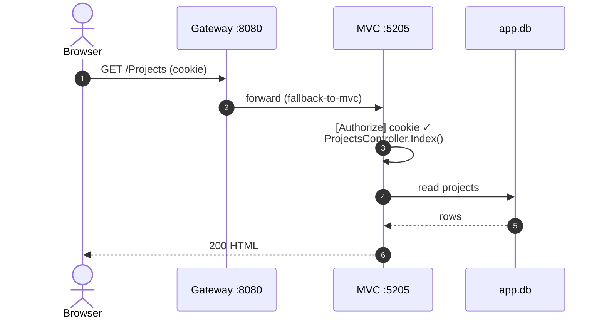
```mermaid
sequenceDiagram
    autonumber
    actor Browser
    participant GW as Gateway :8080
    participant MVC as MVC :5205
    participant DB as app.db

    Browser->>GW: GET /Projects (cookie)
    GW->>MVC: forward (fallback-to-mvc)
    MVC->>MVC: [Authorize] cookie ✓<br/>ProjectsController.Index()
    MVC->>DB: read projects
    DB-->>MVC: rows
    MVC-->>Browser: 200 HTML
```

### New React page + API + WebSocket (full pipeline)

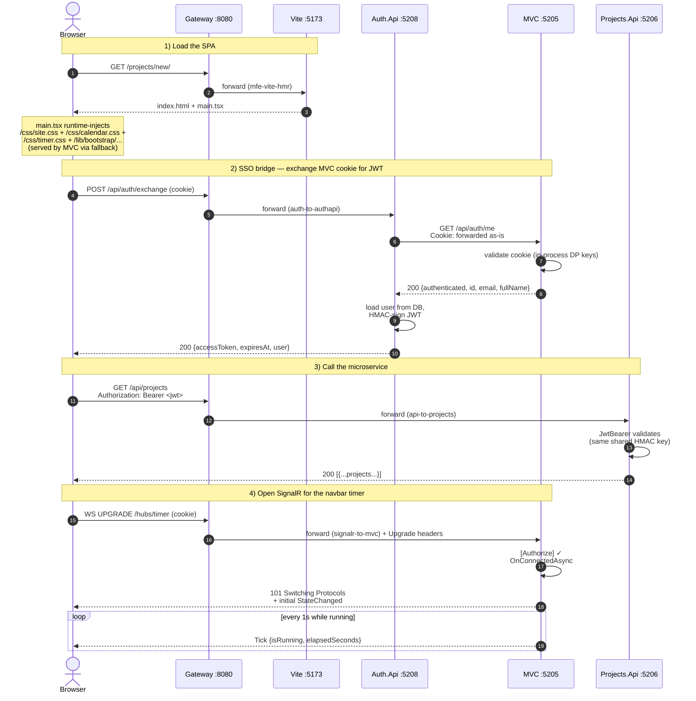
```mermaid
sequenceDiagram
    autonumber
    actor Browser
    participant GW as Gateway :8080
    participant Vite as Vite :5173
    participant Auth as Auth.Api :5208
    participant MVC as MVC :5205
    participant API as Projects.Api :5206

    Note over Browser,Vite: 1) Load the SPA
    Browser->>GW: GET /projects/new/
    GW->>Vite: forward (mfe-vite-hmr)
    Vite-->>Browser: index.html + main.tsx
    Note over Browser: main.tsx runtime-injects<br/>/css/site.css + /css/calendar.css +<br/>/css/timer.css + /lib/bootstrap/...<br/>(served by MVC via fallback)

    Note over Browser,MVC: 2) SSO bridge — exchange MVC cookie for JWT
    Browser->>GW: POST /api/auth/exchange (cookie)
    GW->>Auth: forward (auth-to-authapi)
    Auth->>MVC: GET /api/auth/me<br/>Cookie: forwarded as-is
    MVC->>MVC: validate cookie (in-process DP keys)
    MVC-->>Auth: 200 {authenticated, id, email, fullName}
    Auth->>Auth: load user from DB,<br/>HMAC-sign JWT
    Auth-->>Browser: 200 {accessToken, expiresAt, user}

    Note over Browser,API: 3) Call the microservice
    Browser->>GW: GET /api/projects<br/>Authorization: Bearer <jwt>
    GW->>API: forward (api-to-projects)
    API->>API: JwtBearer validates<br/>(same shared HMAC key)
    API-->>Browser: 200 [{...projects...}]

    Note over Browser,MVC: 4) Open SignalR for the navbar timer
    Browser->>GW: WS UPGRADE /hubs/timer (cookie)
    GW->>MVC: forward (signalr-to-mvc) + Upgrade headers
    MVC->>MVC: [Authorize] ✓<br/>OnConnectedAsync
    MVC-->>Browser: 101 Switching Protocols<br/>+ initial StateChanged
    loop every 1s while running
        MVC-->>Browser: Tick {isRunning, elapsedSeconds}
    end
```

The browser only ever talks to `localhost:8080`. Same origin → no CORS to wrangle, the Identity cookie travels everywhere by default, and the gateway's route table is the single place where "this URL goes to that service" is decided.

---

## Authentication: Option 2 with single sign-on

Four actors:
- **MVC monolith** — owns the user database (`AspNetUsers`), issues the Identity cookie at the existing `/Identity/Account/Login` page, hosts the SignalR hub. **Never modified.**
- **Auth.Api** (`:5208`) — dedicated authentication microservice. Validates passwords against `AspNetUsers` using the same `PasswordHasher<T>` ASP.NET Identity uses (hash-compatible). Issues HMAC-signed JWTs.
- **Projects.Api** (`:5206`) — resource server. Validates JWTs only. Never sees a password.
- **React SPA** — holds the JWT in memory + sessionStorage.

The gateway makes everything the same origin, so the browser sends the Identity cookie and `Authorization: Bearer …` automatically wherever needed. Users sign in **once**.

### High-level: who holds what credential, and why

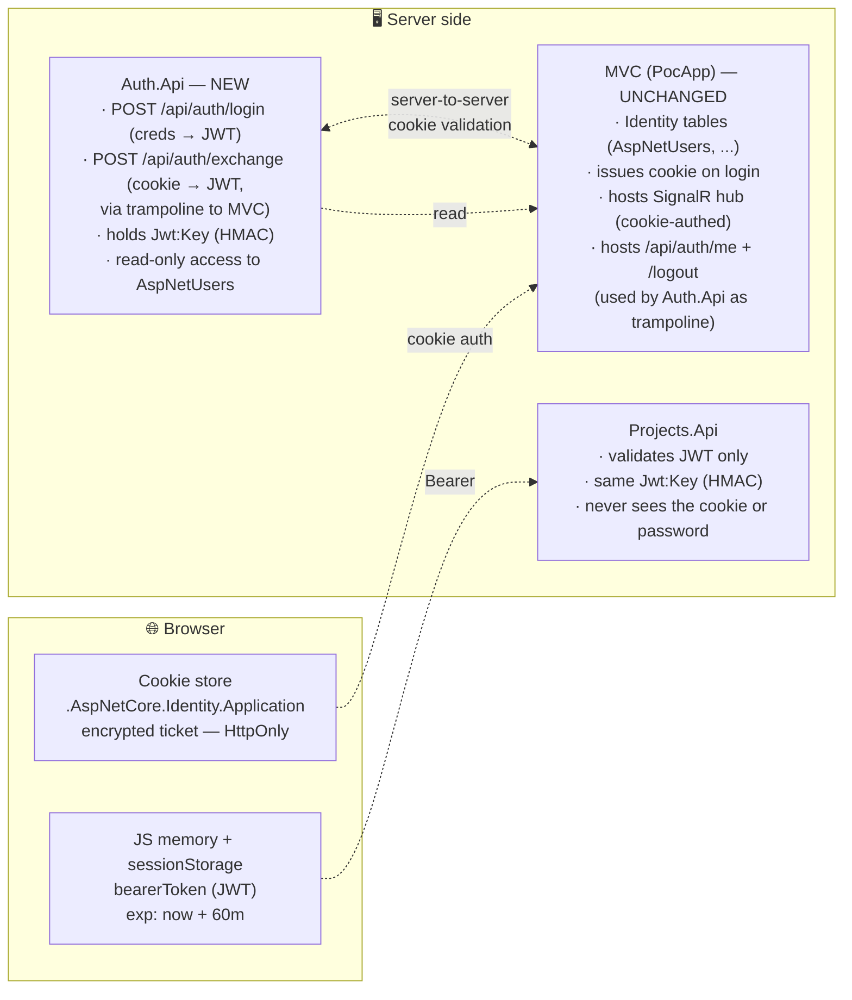
```mermaid
flowchart LR
    subgraph Browser["🌐 Browser"]
        direction TB
        Cookie["Cookie store<br/>.AspNetCore.Identity.Application<br/>encrypted ticket — HttpOnly"]
        JWT["JS memory + sessionStorage<br/>bearerToken (JWT)<br/>exp: now + 60m"]
    end

    subgraph Server["🖥 Server side"]
        direction TB
        MVCNode["MVC (PocApp) — UNCHANGED<br/>· Identity tables (AspNetUsers, ...)<br/>· issues cookie on login<br/>· hosts SignalR hub (cookie-authed)<br/>· hosts /api/auth/me + /logout<br/>(used by Auth.Api as trampoline)"]
        AuthNode["Auth.Api — NEW<br/>· POST /api/auth/login (creds → JWT)<br/>· POST /api/auth/exchange (cookie → JWT,<br/>via trampoline to MVC)<br/>· holds Jwt:Key (HMAC)<br/>· read-only access to AspNetUsers"]
        APINode["Projects.Api<br/>· validates JWT only<br/>· same Jwt:Key (HMAC)<br/>· never sees the cookie or password"]
    end

    Cookie -. cookie auth .-> MVCNode
    JWT -. Bearer .-> APINode
    AuthNode <-. server-to-server<br/>cookie validation .-> MVCNode
    AuthNode -. read .-> MVCNode
```

The split: MVC owns the **user database** and the **Identity cookie** (it always did). Auth.Api owns the **JWT issuance** for the new stack. Auth.Api can validate cookies *because it asks MVC*, not because it shares MVC's keys.

### Sequence A: MVC first → React (the SSO bridge)

User signs in at MVC's login form, navigates to the React SPA. **No second login.**

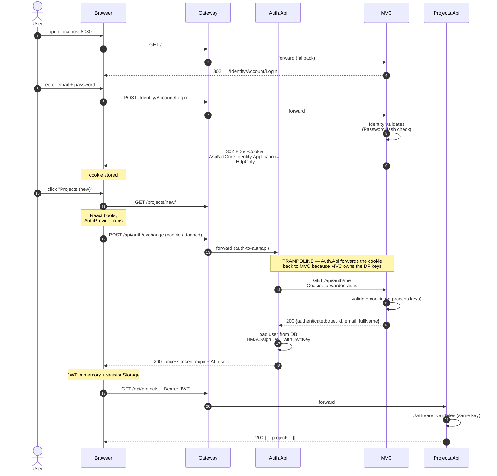
```mermaid
sequenceDiagram
    autonumber
    actor User
    participant B as Browser
    participant GW as Gateway
    participant Auth as Auth.Api
    participant MVC
    participant API as Projects.Api

    User->>B: open localhost:8080
    B->>GW: GET /
    GW->>MVC: forward (fallback)
    MVC-->>B: 302 → /Identity/Account/Login

    User->>B: enter email + password
    B->>GW: POST /Identity/Account/Login
    GW->>MVC: forward
    MVC->>MVC: Identity validates<br/>(PasswordHash check)
    MVC-->>B: 302 + Set-Cookie:<br/>.AspNetCore.Identity.Application=...<br/>HttpOnly
    Note over B: cookie stored

    User->>B: click "Projects (new)"
    B->>GW: GET /projects/new/
    Note over B: React boots,<br/>AuthProvider runs

    B->>GW: POST /api/auth/exchange (cookie attached)
    GW->>Auth: forward (auth-to-authapi)
    Note over Auth,MVC: TRAMPOLINE — Auth.Api forwards the cookie<br/>back to MVC because MVC owns the DP keys
    Auth->>MVC: GET /api/auth/me<br/>Cookie: forwarded as-is
    MVC->>MVC: validate cookie (in-process keys)
    MVC-->>Auth: 200 {authenticated:true, id, email, fullName}
    Auth->>Auth: load user from DB,<br/>HMAC-sign JWT with Jwt:Key
    Auth-->>B: 200 {accessToken, expiresAt, user}
    Note over B: JWT in memory + sessionStorage

    B->>GW: GET /api/projects + Bearer JWT
    GW->>API: forward
    API->>API: JwtBearer validates (same key)
    API-->>B: 200 [{...projects...}]
```

### Sequence B: React first → MVC (also one login)

User opens the SPA URL directly, has no cookie, gets bounced to the same MVC login form, returns to the SPA already authenticated.

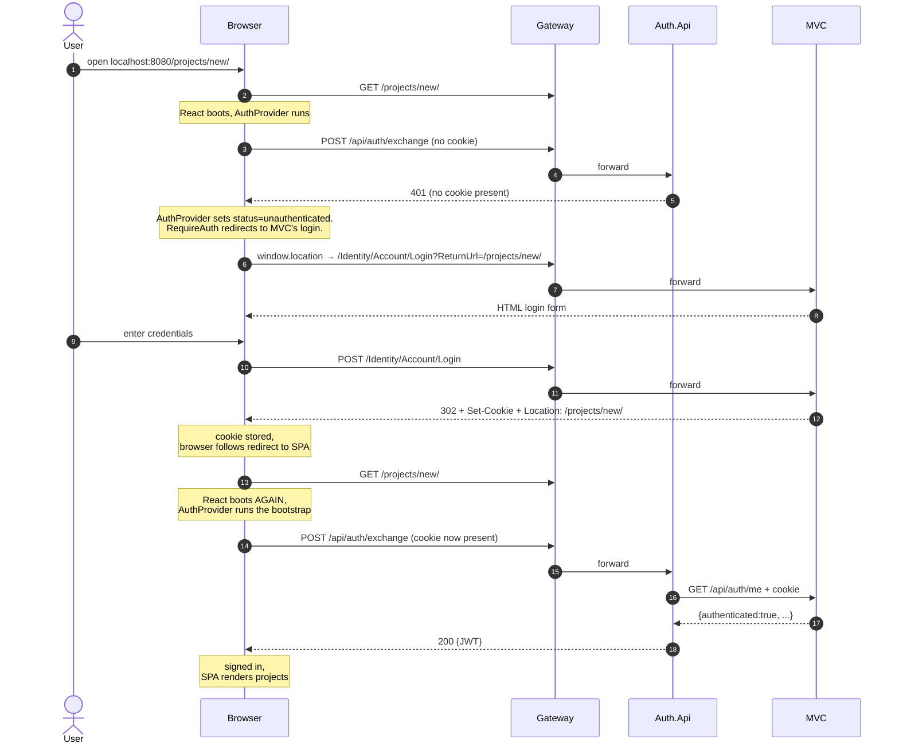
```mermaid
sequenceDiagram
    autonumber
    actor User
    participant B as Browser
    participant GW as Gateway
    participant Auth as Auth.Api
    participant MVC

    User->>B: open localhost:8080/projects/new/
    B->>GW: GET /projects/new/
    Note over B: React boots, AuthProvider runs

    B->>GW: POST /api/auth/exchange (no cookie)
    GW->>Auth: forward
    Auth-->>B: 401 (no cookie present)
    Note over B: AuthProvider sets status=unauthenticated.<br/>RequireAuth redirects to MVC's login.

    B->>GW: window.location → /Identity/Account/Login?ReturnUrl=/projects/new/
    GW->>MVC: forward
    MVC-->>B: HTML login form

    User->>B: enter credentials
    B->>GW: POST /Identity/Account/Login
    GW->>MVC: forward
    MVC-->>B: 302 + Set-Cookie + Location: /projects/new/
    Note over B: cookie stored,<br/>browser follows redirect to SPA

    B->>GW: GET /projects/new/
    Note over B: React boots AGAIN,<br/>AuthProvider runs the bootstrap

    B->>GW: POST /api/auth/exchange (cookie now present)
    GW->>Auth: forward
    Auth->>MVC: GET /api/auth/me + cookie
    MVC-->>Auth: {authenticated:true, ...}
    Auth-->>B: 200 {JWT}
    Note over B: signed in,<br/>SPA renders projects
```

### The trampoline pattern (why this works without touching MVC)

The interesting question: **how can Auth.Api validate MVC's cookie if it doesn't share the Data Protection keys?** Answer: it doesn't. It asks MVC.

ASP.NET Core's Identity cookie is encrypted with Data Protection keys that, in this dev setup, are kept *in-process* by MVC (ephemeral). Auth.Api can't decrypt them. But Auth.Api *can* hand the cookie back to MVC over an internal HTTP call — and MVC, which owns the keys, validates the cookie and returns the user identity.

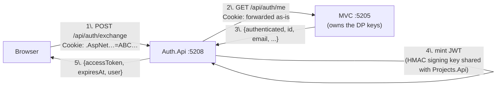
```mermaid
flowchart LR
    Browser -- "1\. POST /api/auth/exchange<br/>Cookie: .AspNet…=ABC…" --> Auth["Auth.Api :5208"]
    Auth -- "2\. GET /api/auth/me<br/>Cookie: forwarded as-is" --> MVC["MVC :5205<br/>(owns the DP keys)"]
    MVC -- "3\. {authenticated, id, email, ...}" --> Auth
    Auth -- "4\. mint JWT<br/>(HMAC signing key shared with Projects.Api)" --> Auth
    Auth -- "5\. {accessToken, expiresAt, user}" --> Browser
```

**Properties:**
- ✅ Zero MVC code change. The endpoint Auth.Api calls (`/api/auth/me`) was already in MVC.
- ✅ Single login form (MVC's existing one).
- ✅ Real SSO — cookie set by MVC unlocks the React SPA seamlessly.
- ⚠️ One extra in-process HTTP hop per cookie exchange (~1ms on localhost).
- ⚠️ Auth.Api depends on MVC being up to validate cookies — by design.

If MVC is offline, Auth.Api's password-login path (`POST /api/auth/login`) still works (it reads `AspNetUsers` directly), so users *can* still sign in. They just lose the SSO-from-cookie convenience.

### Token lifecycle

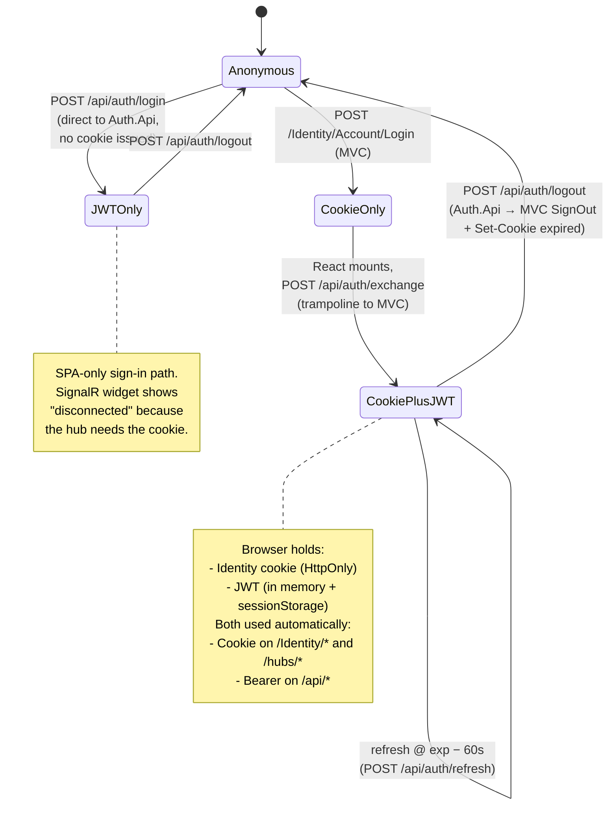
```mermaid
stateDiagram-v2
    [*] --> Anonymous
    Anonymous --> CookieOnly: POST /Identity/Account/Login (MVC)
    CookieOnly --> CookiePlusJWT: React mounts,<br/>POST /api/auth/exchange<br/>(trampoline to MVC)
    Anonymous --> JWTOnly: POST /api/auth/login<br/>(direct to Auth.Api,<br/>no cookie issued)
    CookiePlusJWT --> CookiePlusJWT: refresh @ exp − 60s<br/>(POST /api/auth/refresh)
    CookiePlusJWT --> Anonymous: POST /api/auth/logout<br/>(Auth.Api → MVC SignOut + Set-Cookie expired)
    JWTOnly --> Anonymous: POST /api/auth/logout

    note right of CookiePlusJWT
        Browser holds:
        - Identity cookie (HttpOnly)
        - JWT (in memory + sessionStorage)
        Both used automatically:
        - Cookie on /Identity/* and /hubs/*
        - Bearer on /api/*
    end note

    note right of JWTOnly
        SPA-only sign-in path.
        SignalR widget shows
        "disconnected" because
        the hub needs the cookie.
    end note
```

### SignalR fits the same model

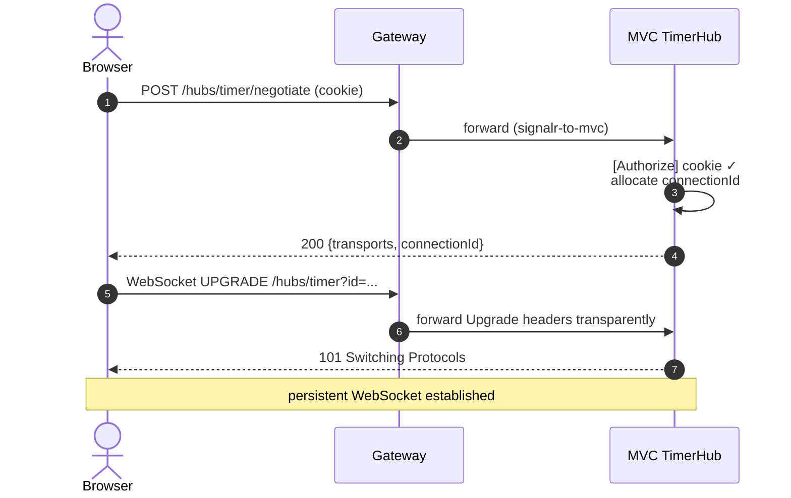
```mermaid
sequenceDiagram
    autonumber
    actor B as Browser
    participant GW as Gateway
    participant Hub as MVC TimerHub

    B->>GW: POST /hubs/timer/negotiate (cookie)
    GW->>Hub: forward (signalr-to-mvc)
    Hub->>Hub: [Authorize] cookie ✓<br/>allocate connectionId
    Hub-->>B: 200 {transports, connectionId}

    B->>GW: WebSocket UPGRADE /hubs/timer?id=...
    GW->>Hub: forward Upgrade headers transparently
    Hub-->>B: 101 Switching Protocols
    Note over B,Hub: persistent WebSocket established
```

The hub uses the **same Identity cookie** the rest of the MVC app uses — JWT is not needed because the hub *lives in* the MVC monolith. The SSO trampoline ensures the SPA also has that cookie even though it primarily uses JWTs.

> ⚠️ **POC shortcut.** The HMAC signing key in `appsettings.json` is symmetric and committed in plaintext. In production you'd use **asymmetric keys** (RS256 + JWKS endpoint), rotate them, and load secrets from a vault. The trampoline pattern is unchanged.

---

## Visual parity: legacy and React look identical

The React MFE deliberately renders the **same DOM as the MVC layout** so the user can't tell which UI they're in. Three things make this work:

1. **Shared stylesheets, served by MVC.**  `Frontends/projects-mfe/src/main.tsx` injects `<link>` tags pointing at `/lib/bootstrap/dist/css/bootstrap.min.css`, `/css/site.css`, `/css/calendar.css`, and `/css/timer.css`. Those URLs go through the YARP gateway's catch-all route to the MVC monolith's `wwwroot`. Both UIs end up styled by the exact same bytes.

2. **`AppShell.tsx` mirrors `_Layout.cshtml`.** Same `<nav>` markup, same brand glyph (`✦` from `site.css`), same nav links, same login partial ("Hello {email}!" + Logout), same footer. Cross-app navigation is plain `<a>` tags — clicking "Projects" goes to `/Projects` (full page nav to MVC), clicking "Projects (new)" routes inside the SPA.

3. **`Calendar.tsx` mirrors the MVC ViewComponent.** Same Monday-first month grid, same task pills, same status colors (todo/in-progress/done/blocked), same prev/next month buttons. Fed by `GET /api/calendar?year=…&month=…&projectId=…` on the microservice.

> The legacy MVC widget and React widget render byte-equivalent HTML. The only "tell" between the two UIs is the URL bar (`/Projects` vs `/projects/new/`). Even that's the same origin.

---

## Real-time: shared stopwatch in the master page

A **SignalR hub** lives in the MVC monolith at `/hubs/timer`. The same widget appears in both the MVC navbar and the React navbar — both subscribe to the same hub through the gateway's WebSocket-aware `/hubs/*` route. State is shared: when **any** logged-in user in **any** tab clicks Stop, every connected client's stopwatch freezes at the same value within ~50ms.

### Components

| File | Role |
|---|---|
| `PocApp/Hubs/TimerState.cs` | Singleton thread-safe state. Tracks `_elapsedAtPauseSec` + `_resumedAt`. Computes `ElapsedSeconds` excluding paused windows — true stopwatch, not wall clock. |
| `PocApp/Hubs/TimerHub.cs` | `[Authorize]` hub. Exposes `Start()` / `Stop()` methods. `OnConnectedAsync` greets joiners with the current state so their UI is correct immediately. |
| `PocApp/Hubs/TimerBroadcastService.cs` | `BackgroundService`. Ticks at 1Hz. **Skips** the broadcast while paused — clients freeze on the last received value. |
| `PocApp/wwwroot/js/timer-widget.js` | Vanilla JS client for the MVC navbar. Loads SignalR via CDN. |
| `Frontends/projects-mfe/src/realtime/useTimer.ts` | React hook. Same wire protocol. |
| `Frontends/projects-mfe/src/components/TimerWidget.tsx` | React component matching the MVC widget pixel-for-pixel. |

### How the pieces fit together

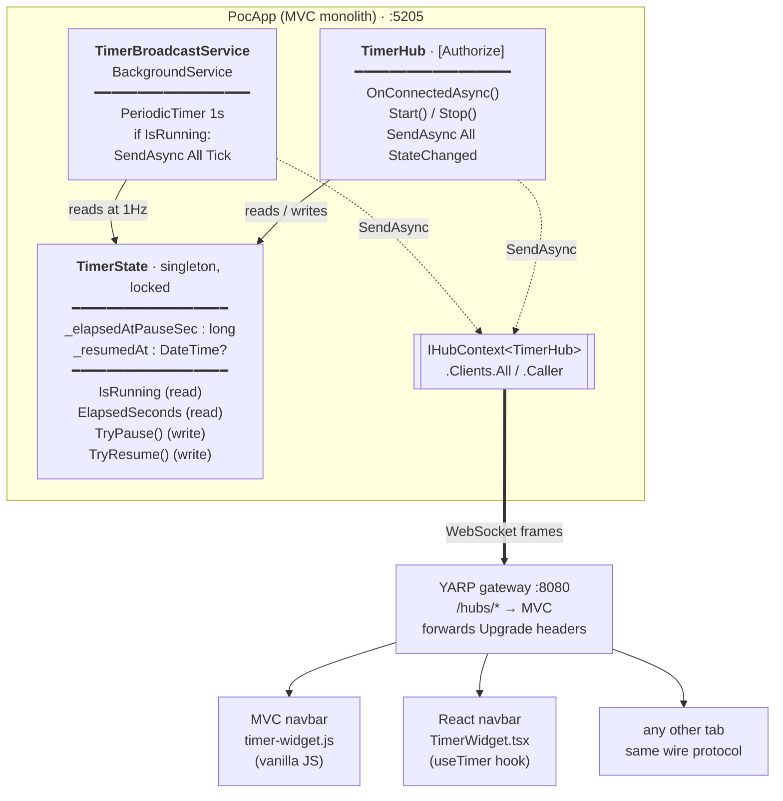
```mermaid
flowchart TB
    subgraph MVC["PocApp (MVC monolith) · :5205"]
        direction TB
        State["<b>TimerState</b> · singleton, locked<br/>━━━━━━━━━━━━━━━━━━<br/>_elapsedAtPauseSec : long<br/>_resumedAt : DateTime?<br/>━━━━━━━━━━━━━━━━━━<br/>IsRunning (read)<br/>ElapsedSeconds (read)<br/>TryPause() (write)<br/>TryResume() (write)"]

        Broadcast["<b>TimerBroadcastService</b><br/>BackgroundService<br/>━━━━━━━━━━━━━━━━━━<br/>PeriodicTimer 1s<br/>if IsRunning:<br/>SendAsync All Tick"]

        Hub["<b>TimerHub</b> · [Authorize]<br/>━━━━━━━━━━━━━━━━━━<br/>OnConnectedAsync()<br/>Start() / Stop()<br/>SendAsync All StateChanged"]

        HubCtx[["IHubContext&lt;TimerHub&gt;<br/>.Clients.All / .Caller"]]

        Broadcast -- "reads at 1Hz" --> State
        Hub -- "reads / writes" --> State
        Broadcast -. SendAsync .-> HubCtx
        Hub -. SendAsync .-> HubCtx
    end

    HubCtx == "WebSocket frames" ==> GW["YARP gateway :8080<br/>/hubs/* → MVC<br/>forwards Upgrade headers"]

    GW --> Tab1["MVC navbar<br/>timer-widget.js<br/>(vanilla JS)"]
    GW --> Tab2["React navbar<br/>TimerWidget.tsx<br/>(useTimer hook)"]
    GW --> Tab3["any other tab<br/>same wire protocol"]
```

### Wire protocol

Both `Tick` (1Hz, only while running) and `StateChanged` (on toggle, on connect) carry the same payload:

```json
{ "isRunning": true, "elapsedSeconds": 142 }
```

Clients have a single `applyPayload(p)` handler bound to both events. New clients get a `StateChanged` immediately on connect (in `OnConnectedAsync`), so their UI is correct even if the timer is currently paused.

### Sequence: a new client joining mid-flight

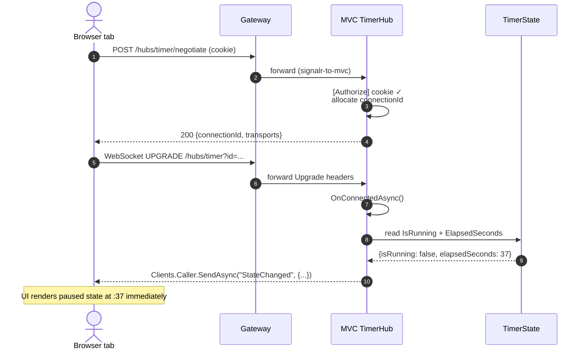
```mermaid
sequenceDiagram
    autonumber
    actor B as Browser tab
    participant GW as Gateway
    participant Hub as MVC TimerHub
    participant S as TimerState

    B->>GW: POST /hubs/timer/negotiate (cookie)
    GW->>Hub: forward (signalr-to-mvc)
    Hub->>Hub: [Authorize] cookie ✓<br/>allocate connectionId
    Hub-->>B: 200 {connectionId, transports}

    B->>GW: WebSocket UPGRADE /hubs/timer?id=...
    GW->>Hub: forward Upgrade headers
    Hub->>Hub: OnConnectedAsync()
    Hub->>S: read IsRunning + ElapsedSeconds
    S-->>Hub: {isRunning: false, elapsedSeconds: 37}
    Hub-->>B: Clients.Caller.SendAsync("StateChanged", {...})
    Note over B: UI renders paused state at :37 immediately
```

This is why opening a new tab during a paused window shows the correct paused state, not a blank `00:00`.

### Sequence: 1Hz tick broadcast (steady state)

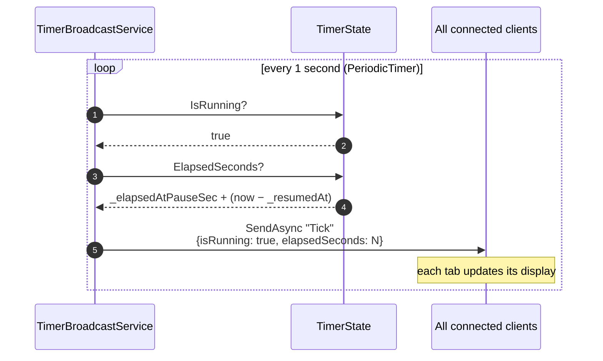
```mermaid
sequenceDiagram
    autonumber
    participant BG as TimerBroadcastService
    participant S as TimerState
    participant Clients as All connected clients

    loop every 1 second (PeriodicTimer)
        BG->>S: IsRunning?
        S-->>BG: true
        BG->>S: ElapsedSeconds?
        S-->>BG: _elapsedAtPauseSec + (now − _resumedAt)
        BG->>Clients: SendAsync "Tick"<br/>{isRunning: true, elapsedSeconds: N}
        Note over Clients: each tab updates its display
    end
```

### Sequence: pause/resume across multiple clients

The interesting case — Tab A clicks **Stop**, Tab B sees the pause; Tab B clicks **Start**, Tab A sees the resume. The shared `TimerState` is the only thing that knows the truth.

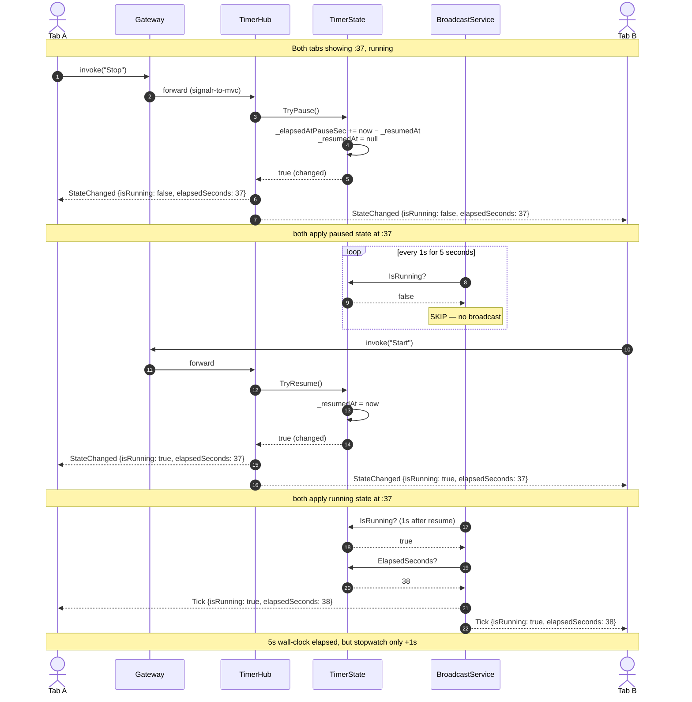
```mermaid
sequenceDiagram
    autonumber
    actor A as Tab A
    participant GW as Gateway
    participant Hub as TimerHub
    participant S as TimerState
    participant BG as BroadcastService
    actor B as Tab B

    Note over A,B: Both tabs showing :37, running

    A->>GW: invoke("Stop")
    GW->>Hub: forward (signalr-to-mvc)
    Hub->>S: TryPause()
    S->>S: _elapsedAtPauseSec += now − _resumedAt<br/>_resumedAt = null
    S-->>Hub: true (changed)
    Hub-->>A: StateChanged {isRunning: false, elapsedSeconds: 37}
    Hub-->>B: StateChanged {isRunning: false, elapsedSeconds: 37}
    Note over A,B: both apply paused state at :37

    loop every 1s for 5 seconds
        BG->>S: IsRunning?
        S-->>BG: false
        Note over BG: SKIP — no broadcast
    end

    B->>GW: invoke("Start")
    GW->>Hub: forward
    Hub->>S: TryResume()
    S->>S: _resumedAt = now
    S-->>Hub: true (changed)
    Hub-->>A: StateChanged {isRunning: true, elapsedSeconds: 37}
    Hub-->>B: StateChanged {isRunning: true, elapsedSeconds: 37}
    Note over A,B: both apply running state at :37

    BG->>S: IsRunning? (1s after resume)
    S-->>BG: true
    BG->>S: ElapsedSeconds?
    S-->>BG: 38
    BG-->>A: Tick {isRunning: true, elapsedSeconds: 38}
    BG-->>B: Tick {isRunning: true, elapsedSeconds: 38}
    Note over A,B: 5s wall-clock elapsed, but stopwatch only +1s
```

Note that **5 seconds elapse between the two Stop/Start clicks but `elapsedSeconds` only goes from 37 → 38** — exactly one tick of running time, not the wall-clock 5 seconds. That's the stopwatch semantic.

### TimerState — state machine

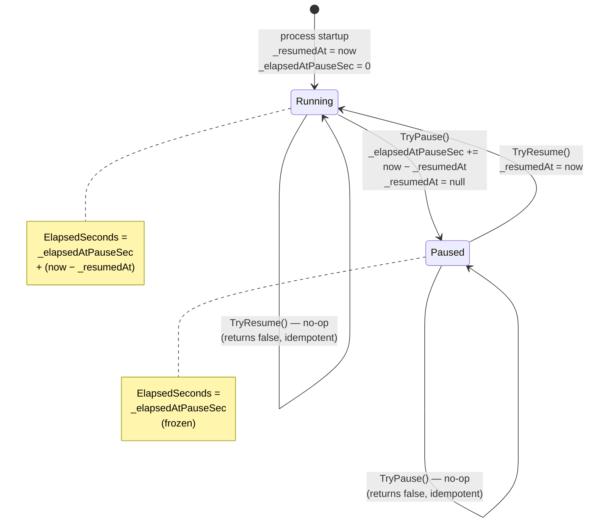
```mermaid
stateDiagram-v2
    [*] --> Running: process startup<br/>_resumedAt = now<br/>_elapsedAtPauseSec = 0

    Running --> Paused: TryPause()<br/>_elapsedAtPauseSec += now − _resumedAt<br/>_resumedAt = null
    Paused --> Running: TryResume()<br/>_resumedAt = now

    Running --> Running: TryResume() — no-op<br/>(returns false, idempotent)
    Paused --> Paused: TryPause() — no-op<br/>(returns false, idempotent)

    note right of Running
        ElapsedSeconds =
          _elapsedAtPauseSec
          + (now − _resumedAt)
    end note

    note right of Paused
        ElapsedSeconds =
          _elapsedAtPauseSec
        (frozen)
    end note
```

**Process restart:** both fields reset → `Running` with `elapsedSeconds = 0`. No persistence in this POC; production would back this with Redis.

**Idempotent toggles:** `TryPause` / `TryResume` return `false` when the state was already in the requested mode, preventing double-click spam from re-broadcasting `StateChanged`.

### Why pausing actually pauses

A naive implementation would send live wall-clock time and freeze the display when paused. But **wall-clock time keeps moving**, so when you resume, the displayed value would jump forward by the pause duration. That feels broken — "the timer kept ticking while paused".

This implementation is a *true stopwatch*: `ElapsedSeconds` is computed by the server as `accumulated_running_time + (running ? now − last_resume : 0)`. Pausing captures the running time so far; resuming starts a new running interval. The displayed value never skips over a paused window.

### How SignalR survives the proxy

YARP forwards WebSocket upgrade requests transparently — no special config beyond the `/hubs/*` route. The browser sends the Identity cookie on the negotiate POST, MVC's `[Authorize]` accepts it, the WebSocket upgrade lands at `TimerHub`. From then on, every push goes back through the same persistent socket via the gateway. `withAutomaticReconnect()` on both clients handles transient disconnects with exponential backoff; on reconnect, `OnConnectedAsync` re-sends the current `StateChanged` so the rejoiner's UI is correct.

---

## How the data lives during migration

This POC uses the **shared-database strangler pattern**: both the monolith and the microservice point at the same SQLite file.

| Table | Owner (writes) | Reader |
|---|---|---|
| `Projects` | `Projects.Api` (via `ProjectsDbContext`) | both — MVC keeps reading it for its own Project pages |
| `Tasks` | `PocApp` MVC | `Projects.Api` reads it (read-only `TaskRow`) for project task counts and the calendar feed |
| `AspNetUsers` (+ Identity tables) | `PocApp` MVC | `Projects.Api` reads it (read-only `OwnerView` projection) |

Migrations live in **`PocApp` only**. The microservice has zero ownership of the schema — it explicitly maps to existing tables and has no `Migrate()` call.

**Why this works for migration but not forever:**
- ✅ Lets you cut over UI piece-by-piece without forcing a DB split first.
- ✅ No data sync to write or maintain.
- ❌ The two apps are still deployment-coupled to schema changes.
- ❌ Doesn't scale — eventually `Projects.Api` should own its own database.

The clean evolution is:
1. `Projects.Api` gets its own `projects.db`, MVC pushes `ProjectChanged` events.
2. Eventually MVC stops reading `Projects` directly and queries the API.
3. The `Projects` table is deleted from `app.db`.

---

## Running it

### One-time prerequisites

- **.NET 8 SDK** (`global.json` pins to 8.0.420)
- **Node.js 20+** and npm
- **EF tools**: `dotnet tool install --global dotnet-ef`

First time only, install React deps:

```bash
cd Frontends/projects-mfe
npm install
```

### Start everything (5 terminals)

```bash
# Terminal 1 — Legacy MVC monolith (Identity, SignalR hub, /api/auth/me trampoline target)
cd PocApp && dotnet run

# Terminal 2 — Projects microservice (CRUD on projects, JWT-validated)
cd Services/Projects.Api && dotnet run

# Terminal 3 — Auth microservice (login, JWT issuance, cookie-trampoline SSO bridge)
cd Services/Auth.Api && dotnet run

# Terminal 4 — YARP gateway (the front door)
cd Gateway/PocApp.Gateway && dotnet run

# Terminal 5 — React micro-frontend (Vite dev server with HMR)
cd Frontends/projects-mfe && npm run dev
```

Then open **http://localhost:8080**.

### Ports cheat sheet

| Port | Service | Purpose |
|---|---|---|
| `:8080` | **PocApp.Gateway** | The only URL you actually use |
| `:5205` | PocApp (MVC) | Legacy app + Identity + SignalR `TimerHub` + `/api/auth/me` trampoline target |
| `:5206` | Projects.Api | Project CRUD (JWT-authenticated) |
| `:5208` | Auth.Api | Login, JWT issuance, cookie-exchange SSO bridge |
| `:5173` | Vite | React dev server (HMR) |

### Seeded accounts

| Email | Password |
|---|---|
| `alice@example.com` | `Passw0rd!` |
| `bob@example.com` | `Passw0rd!` |

### What to click to see everything in action

1. **Single sign-on demo:** Open `localhost:8080/`, click **Login**, sign in via the existing MVC form (`alice@example.com / Passw0rd!`). Now click **"Projects (new)"**. The React SPA loads and you're already signed in — no second login. Behind the scenes the SPA called `POST /api/auth/exchange`, which trampolined through MVC and got a JWT.

2. **Reverse direction:** Open a fresh incognito window on `localhost:8080/projects/new/`. The SPA detects no session → redirects to MVC's login form → you sign in → MVC redirects back to `/projects/new/` → SPA exchanges the cookie for a JWT → projects load. **One login.**

3. **Shared real-time stopwatch:** notice the widget in the navbar — green dot + `MM:SS` counter ticking once per second + `[■ Stop]` button. Click **Stop** in tab 1, tab 2's stopwatch freezes within ~50ms. The shared state lives on the server (one `TimerState` singleton).

4. **Visual parity:** click **"Projects"** (legacy MVC page) and **"Projects (new)"** (React) back to back. Same Bootstrap, same calendar, same colors. URL bar is the only tell.

5. **Cross-UI write through:** create a project in the React UI → refresh the legacy page → it's there. Edit a project in the legacy UI → refresh the React page → updated.

6. **Logout everywhere:** click **Logout** in either UI. Auth.Api forwards the cookie to MVC's `/api/auth/logout`, MVC clears it, Auth.Api also issues a `Set-Cookie: ...; expires=past` for safety, and the SPA discards the JWT. You're anonymous in both UIs.

7. The other tabs (Home / Tasks / Users) keep using the monolith — only Projects has been "extracted".

---

## Adding a new microservice route (the cutover playbook)

Say tomorrow you want to migrate **Tasks** the same way. The pattern is now repeatable:

1. Add CRUD endpoints to a new `Tasks.Api` service (or the existing one) on, say, `:5207`.
2. Add a YARP cluster + route in [Gateway/PocApp.Gateway/appsettings.json](Gateway/PocApp.Gateway/appsettings.json):
   ```json
   "Routes": {
     "tasks-to-api": { "ClusterId": "tasks-api", "Match": { "Path": "/api/tasks/{**catch-all}" } }
   },
   "Clusters": {
     "tasks-api": { "Destinations": { "t1": { "Address": "http://localhost:5207/" } } }
   }
   ```
3. Add a route to the React app (or scaffold a new MFE).
4. Add a "Tasks (new)" link to `_Layout.cshtml`.
5. **You did not touch the monolith's Tasks code.** It keeps working until you decide to delete it.

To **roll back** a cutover, delete the YARP route. That's it.

---

## Configuration reference

### Shared JWT settings

The `Jwt` section must match in **all three** apps that touch JWTs. Mismatch → 401s.

| App | Role |
|---|---|
| `Services/Auth.Api/appsettings.json` | **Issuer** — signs JWTs with this key |
| `Services/Projects.Api/appsettings.json` | **Validator** — verifies JWTs with this key |
| `PocApp/appsettings.json` | Holds the section for the legacy `AuthController` (currently unused via the gateway, but kept for completeness — Auth.Api owns issuance now) |

```json
"Jwt": {
  "Issuer": "PocApp",
  "Audience": "PocApp.Api",
  "Key": "POC_DEV_ONLY_SHARED_HMAC_KEY_pls_replace_with_secret_in_prod_32B+",
  "ExpiresMinutes": 60
}
```

### Database connection strings

Both apps point at the same SQLite file. The microservice uses a relative path back to the monolith's project folder — fine for dev, would obviously change in real deployments.

### YARP routes

[`Gateway/PocApp.Gateway/appsettings.json`](Gateway/PocApp.Gateway/appsettings.json) is the **single place that controls cutover**. Reorder, add, or remove routes here to migrate URLs from monolith to microservice without touching either's code.

Current routes (in evaluation order):

| Match | Cluster | Why |
|---|---|---|
| `/api/auth/{**catch-all}` | `auth-api` | Login, JWT issuance, cookie exchange, refresh — all live on the dedicated Auth.Api |
| `/hubs/{**catch-all}` | `mvc` | SignalR hub lives on the monolith — explicit route to make WebSocket forwarding obvious |
| `/api/{**catch-all}` | `projects-api` | All other API calls go to the resource microservice |
| `/projects/new/{**catch-all}` | `vite` | The React MFE itself |
| `/@vite/*`, `/@fs/*`, `/@id/*`, `/node_modules/*`, `/src/*` | `vite` | Vite's dev-time module graph |
| `{**catch-all}` (fallback) | `mvc` | Everything else — including `/css/*`, `/lib/*`, `/js/*` static files, `/Identity/Account/Login`, all legacy MVC pages |

**Note:** the `/api/auth/*` cluster does NOT include MVC's `/api/auth/me` and `/api/auth/logout` — those are reached server-to-server by Auth.Api on `:5205` directly (not via the gateway). They're not exposed to the browser.

### React MFE configuration

`Frontends/projects-mfe/vite.config.ts`:

```ts
{
  base: '/projects/new/',          // matches the gateway's MFE route
  server: {
    port: 5173,
    strictPort: true,
    hmr: { clientPort: 8080 },     // HMR websocket targets the gateway
  },
}
```

**Why the stylesheets are injected at runtime, not in `index.html`:** Vite rewrites every `<link href="/...">` it finds in HTML to be base-path-prefixed. That broke the cross-origin trick for sharing MVC's `wwwroot`. Injecting them via `document.createElement('link')` in `main.tsx` bypasses the transform — see the comment block in that file.

---

## Things deliberately left out (and why)

| What | Why |
|---|---|
| HTTPS / cert trust | Localhost POC. Add `app.UseHttpsRedirection()` + a real cert for prod. |
| Refresh tokens | The MVC Identity cookie *is* the refresh mechanism here — re-fetching `/api/auth/exchange` returns a new JWT as long as the cookie is valid. Auth.Api also has `POST /api/auth/refresh` (JWT → JWT) for the password-only login path. |
| Email confirmation | Disabled in `Program.cs` for POC convenience. |
| Identity owned by a microservice | The user database (`AspNetUsers`) is still owned by MVC. Auth.Api reads it; it doesn't write. Extracting Identity itself is the hardest part of any migration and intentionally out of scope here. |
| Asymmetric JWT signing (RS256 + JWKS) | Symmetric HMAC for the POC. Auth.Api and Projects.Api share a key string. Production would use a key pair + JWKS endpoint. |
| Production build pipeline | `npm run build` works, but no script yet to drop `dist/` into the gateway's `wwwroot/`. |
| Distributed tracing | OpenTelemetry should be wired up before this hits prod. |
| Real DB split | Shared `app.db` keeps the POC simple. Real migration would split + sync via events. |
| Backplane for SignalR (Redis) | `TimerState` is an in-process singleton. Horizontally scaling MVC would need a Redis backplane (`AddSignalR().AddStackExchangeRedis()`) plus shared state in Redis. |
| Persistent Data Protection keys | MVC uses ephemeral DP keys here — restart MVC and any active Identity cookie becomes invalid. Production would call `AddDataProtection().PersistKeysToFileSystem(...)` (or Redis/Azure KV). The trampoline pattern works either way; persistent keys would just allow direct cookie decryption in Auth.Api as an alternative. |
| Tests | No xUnit / Playwright suite yet. |

---

## Tech stack summary

| Layer | Technology |
|---|---|
| **Monolith** | ASP.NET Core MVC 8.0, Razor Views, ASP.NET Identity (cookie auth), SignalR |
| **Auth microservice** | ASP.NET Core 8.0 Minimal API, JWT bearer auth, `IPasswordHasher<T>` for hash-compatible password verify, IHttpClientFactory for the cookie-validation trampoline |
| **Resource microservice** | ASP.NET Core 8.0 Minimal API, JWT bearer auth |
| **Gateway** | YARP 2.2 (Microsoft's reverse proxy library — handles WebSocket upgrades natively) |
| **Persistence** | EF Core 8.0 + SQLite (shared during migration) |
| **Real-time** | SignalR (hub on MVC, vanilla JS client on MVC, `@microsoft/signalr` on React, both through YARP) |
| **Frontend (legacy)** | Razor + Bootstrap 5 |
| **Frontend (new)** | React 18 + TypeScript + Vite + React Router + TanStack Query + axios + `@microsoft/signalr` |
| **Tooling** | dotnet CLI, dotnet-ef, npm |

---

## Operational notes

- **After editing any `.cshtml`** (or its `.cshtml.css` companion), do a clean rebuild — Razor views are precompiled into the assembly, not compiled at runtime:
  ```bash
  cd PocApp && rm -rf bin obj && cd .. && dotnet build PocApp.sln
  ```
  Or add `Microsoft.AspNetCore.Mvc.Razor.RuntimeCompilation` for hot-recompile during dev.
- **After editing wwwroot static files** (CSS / JS), a hard refresh (`Ctrl+Shift+R`) busts the browser cache. Vite HMR updates the React MFE live.
- **To stop everything**: `taskkill //IM dotnet.exe //F && taskkill //IM node.exe //F` on Windows; the equivalent `pkill` on macOS/Linux.
