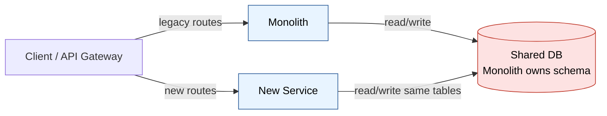
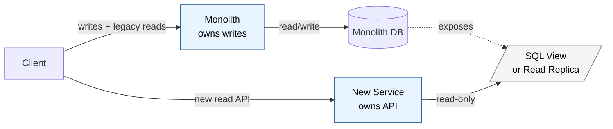
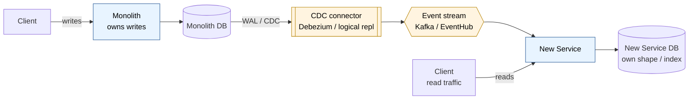
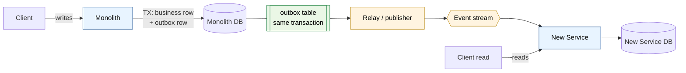
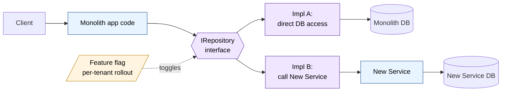
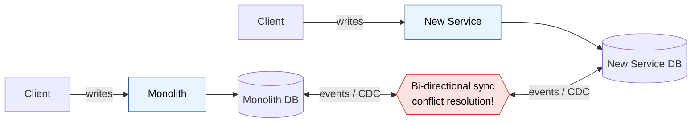

# Strangler Fig — Data Extraction Options

The hard part of strangler fig isn't the code path (routing/facade is well-understood) — it's the **data**. Six practical options, roughly ordered from least-to-most invasive.

## 1. Shared Database (transition only)

New service reads/writes the monolith's tables directly.

- **Pros:** Zero data migration risk, fastest to ship, transactions still work.
- **Cons:** Violates service boundaries, schema becomes a public API, can't evolve independently.
- **Use when:** Week 1–4 of extraction, proving the slice works before committing to data ownership. Treat as scaffolding with a removal date.

## 2. Database View / API Facade over Monolith DB

New service owns its API but reads from the monolith via views, a thin read API, or a read replica.

- **Pros:** Service can evolve its public contract; monolith keeps owning the data.
- **Cons:** Writes still go through the monolith; coupling persists.
- **Use when:** The new service is **read-heavy** (reporting, search, dashboards). Common first step.

## 3. Change Data Capture (CDC) → Owned Read Store

Debezium / SQL Server CDC / Postgres logical replication streams the monolith's tables into the new service's own store (often shaped differently — denormalized, document, search index).

- **Pros:** New service owns its read model, can reshape data, no monolith query load.
- **Cons:** Eventually consistent; schema-change coordination; need a replay/snapshot strategy.
- **Use when:** Read model needs a different shape (e.g., search, projections, materialized views). The **workhorse pattern** for most extractions.

## 4. Dual-Write with Outbox

Monolith writes to its DB + an outbox table in the same transaction. A relay publishes events; the new service consumes and builds its own store. Once cut over, writes flip to the new service which now owns the data.

- **Pros:** Atomic write + event (no lost events), explicit migration path to true ownership.
- **Cons:** Requires monolith code changes; needs the outbox infrastructure.
- **Use when:** You will eventually transfer **write ownership**, not just reads. Standard path to true microservice independence.

## 5. Branch by Abstraction at the Repository Layer

Introduce an interface inside the monolith. Implementation A = old direct DB access. Implementation B = call the new service. Toggle per-tenant/per-feature-flag.

- **Pros:** Fine-grained rollout, instant rollback, A/B comparison ("shadow writes") to verify parity before cutover.
- **Cons:** Lives inside the monolith; doesn't help with the data move itself — pair with #3 or #4.
- **Use when:** The monolith is the only client and you need a safe, reversible cutover. Almost always worth doing in combination with another option.

## 6. Bi-directional Sync (last resort)

Both sides own the data during transition; sync runs both ways.

- **Pros:** Allows long parallel-run periods.
- **Cons:** Conflict resolution is genuinely hard (last-write-wins is rarely correct); easy to corrupt data.
- **Use when:** You truly cannot freeze writes on either side and the migration window is months. Avoid if possible.

## Choosing between them

Three questions:

1. **Read or write ownership?** Read-only → #2 or #3. Write ownership → #4.
2. **Same shape or different shape?** Same → views/CDC. Different (denormalized, search, aggregated) → CDC with a projection.
3. **Cutover window?** Big-bang allowed → simpler. Long parallel run required → branch-by-abstraction + shadow reads/writes for verification.

## Cross-cutting concerns

- **Distributed transactions:** Replace with sagas or accept eventual consistency. Identify which workflows currently span the boundary — those need redesign, not just extraction.
- **Foreign keys across the boundary:** Become application-enforced references. Plan for orphan detection.
- **Reporting/analytics:** Joining across both DBs hurts. Often a separate warehouse/lakehouse fed by CDC from both sides is the answer.
- **ID strategy:** If the monolith uses auto-increment IDs, switch new entities to UUIDs/ULIDs before extraction so IDs are portable.
- **Backfill + replay:** Whatever pipeline you build, it must support "wipe the target and rebuild from scratch." You will need this more than once.
