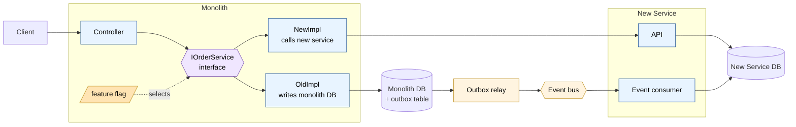
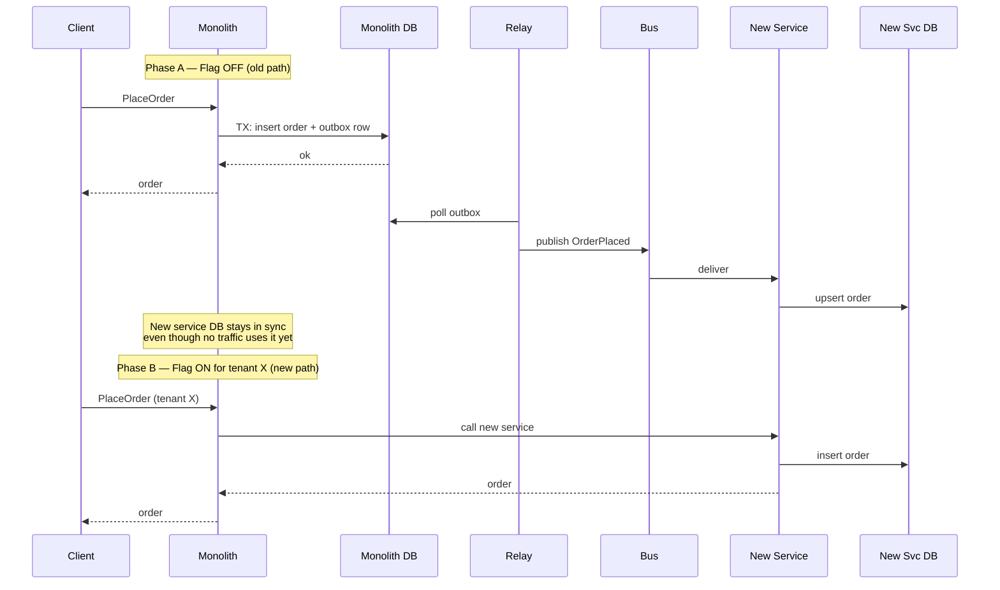
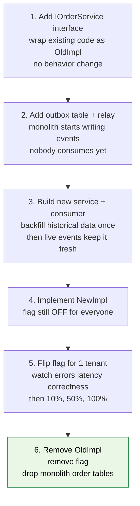

# Recommended Approach — Branch-by-Abstraction + Outbox

Two patterns, one job each:

- **Branch-by-Abstraction** = how requests choose old or new path *(the switch)*
- **Outbox** = how data reliably gets from monolith to new service *(the pipe)*

## The picture



## Part 1 — Branch-by-Abstraction (the switch)

**Goal:** make the choice between old and new path a runtime decision, reversible at any time.

### Step 1. Introduce an interface at the right level

Pick the **domain operation**, not the data access.

```csharp
// Right level — domain operation
public interface IOrderService {
    Task<Order> PlaceOrder(PlaceOrderCommand cmd);
    Task<Order> GetById(OrderId id);
}
```

Not `IOrderTableRepository.SelectFromOrders(...)`. That seam leaks SQL into your interface; the new service can't satisfy it without re-implementing your schema.

### Step 2. Two implementations

```csharp
class MonolithOrderService : IOrderService {
    // current code — direct DB access, unchanged
}

class NewServiceOrderService : IOrderService {
    // HTTP/gRPC call to the new service
}
```

### Step 3. A switch that picks one

```csharp
class RoutingOrderService(
    MonolithOrderService oldImpl,
    NewServiceOrderService newImpl,
    IFeatureFlags flags
) : IOrderService {
    public Task<Order> PlaceOrder(PlaceOrderCommand cmd) =>
        flags.UseNew("orders", cmd.TenantId)
            ? newImpl.PlaceOrder(cmd)
            : oldImpl.PlaceOrder(cmd);
}
```

The flag must be **per-tenant** (or per-customer, per-route) so you can roll out gradually. Global on/off is too coarse.

### Why this matters

- **Reversible.** Flip the flag back, you're on the old path. No rollback deployment.
- **Gradual.** Internal tenant → 1% → 10% → 100%.
- **Comparable.** Same input, two implementations — you can measure latency and correctness side-by-side.

## Part 2 — Outbox (the pipe)

**Goal:** the new service's database needs to stay in sync with what the monolith does.

### The problem it solves

Naive code:

```csharp
db.Save(order);                    // 1
bus.Publish(new OrderPlaced(...)); // 2
```

If step 1 succeeds and step 2 fails → event lost. If step 2 succeeds and step 1 fails → event for a write that never happened. **No way to make these atomic across two systems.**

### The fix

Write the event into an **outbox table in the same database transaction** as the business row:

```sql
BEGIN TRANSACTION;
  INSERT INTO orders (id, customer_id, status, total) VALUES (...);
  INSERT INTO outbox (id, aggregate_id, type, payload, created_at)
  VALUES (newid(), @order_id, 'OrderPlaced', @json, sysutcdatetime());
COMMIT;
```

One transaction, one database. Either both rows commit or neither does.

### The relay

A background worker reads the outbox and publishes:

```csharp
while (running) {
    var batch = db.Query(@"
        SELECT TOP 100 id, type, payload
        FROM outbox
        WHERE processed_at IS NULL
        ORDER BY id");

    foreach (var row in batch) {
        await bus.Publish(row.Type, row.Payload);
        db.Execute("UPDATE outbox SET processed_at = sysutcdatetime() WHERE id = @id", row.Id);
    }

    if (!batch.Any()) await Task.Delay(500);
}
```

Three properties to get right:

| Property | How |
|---|---|
| **At-least-once delivery** | Relay can crash mid-publish; consumer must be idempotent (dedupe by event id) |
| **Ordering per aggregate** | Process by `aggregate_id` partition, or include a sequence number per aggregate |
| **No back-pressure on writers** | Relay is a separate process; monolith writes never wait on it |

### The consumer

```csharp
async Task Handle(OrderPlaced evt) {
    if (await db.AlreadyProcessed(evt.EventId)) return;  // idempotency
    await db.UpsertOrder(evt.OrderId, evt.CustomerId, ...);
    await db.MarkProcessed(evt.EventId);
}
```

## How the two parts work together



The outbox keeps the new service's DB **warm and current** while the flag is still OFF. The moment you flip the flag for a tenant, the new service can serve writes because it already has all the historical data.

## The rollout (six steps, in order)



Notes on the order:

- **Outbox goes in before the new service is useful.** The new service's DB is built from outbox events, not from a separate migration script. One pipeline, used for both backfill and ongoing sync.
- **NewImpl is implemented before any traffic uses it.** Test it in staging, with the flag on for a fake tenant, before any real customer touches it.
- **Step 5 is where things actually move.** Steps 1–4 are reversible with no customer impact. Step 5 is where you find bugs — go slow.
- **Step 6 is the last 20% that takes 80% of the time.** Don't underestimate it.

## What goes wrong

| Problem | Cause | Fix |
|---|---|---|
| Outbox table grows unbounded | Nothing deletes processed rows | Background job: delete `processed_at < now() - 7 days` |
| Relay falls behind under load | Single-threaded relay, big batches | Partition by `aggregate_id`, run N relay workers |
| Duplicate events on consumer | At-least-once delivery | Idempotency: dedupe by event id in new svc DB |
| Out-of-order events | Multiple relay workers, no partition key | Always partition by aggregate id; never round-robin |
| Schema drift between sides | Monolith changes columns, new svc doesn't know | Versioned event schemas; schema registry; contract tests |
| Flag flip exposes new-path bug | Insufficient testing before rollout | Smaller tenant cohort first; add shadow comparison if correctness is critical |
| Cross-aggregate transaction | Operation writes to two aggregates atomically | Redesign as saga **before** extracting, not during |

## Optional addition — shadow reads

If correctness matters more than availability (financial, legal, billing), add a **third implementation** that calls both and compares — but always returns the old result until you trust the new one:

```csharp
class ShadowOrderService(
    MonolithOrderService old,
    NewServiceOrderService newer,
    IDiffSink sink
) : IOrderService {
    public async Task<Order> GetById(OrderId id) {
        var oldT = old.GetById(id);
        var newT = newer.GetById(id);
        await Task.WhenAll(oldT, newT);
        if (!Order.Equivalent(oldT.Result, newT.Result))
            sink.Record(id, oldT.Result, newT.Result);
        return oldT.Result;  // user sees the old result
    }
}
```

Three flag modes: `Off` → `Shadow` → `New`. Only flip to `New` once the diff rate is at zero.

## Summary

- **Branch-by-Abstraction:** interface + two implementations + per-tenant flag. Reversible cutover.
- **Outbox:** business row + event row in one transaction + relay + idempotent consumer. Reliable data movement.
- **Together:** the outbox keeps the new service's DB current while the flag is off, so flipping the flag is a routing change, not a data migration.
