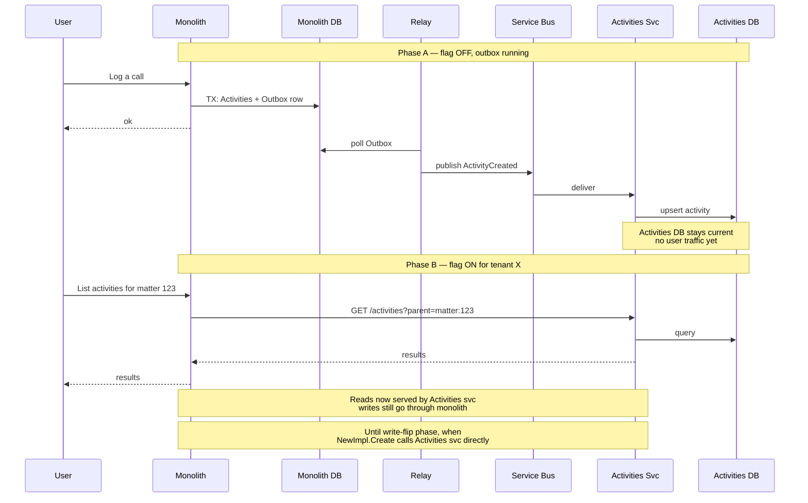
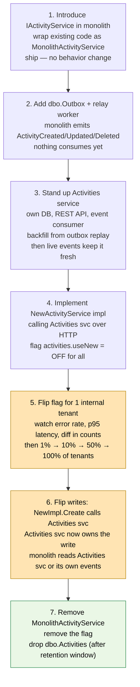

# Activities Microservice — Extraction Plan

Applying **Branch-by-Abstraction + Outbox** to the Activities domain as the first extraction candidate from the monolith.

## Why Activities first

Activities (calls / notes / tasks / meetings / time entries logged against a parent — matter, contact, etc.) is a good first candidate because:

- **Bounded.** Activities reference parent IDs but aren't deeply joined with billing/auth.
- **Mostly append + read.** Updates and deletes exist but are far less common than create/read. Eventual consistency is acceptable.
- **High volume, low criticality per record.** Losing a single activity is recoverable; you're not moving money.
- **Existing index pressure.** Often a pain point in the monolith DB — extracting it relieves the parent DB.

## Architecture

```mermaid
flowchart LR
    Client[Web / Mobile / API]

    subgraph Mono[Monolith]
      Ctrl["ActivitiesController<br/>List / Create / Update"]
      Repo{{IActivityService<br/>interface}}
      Old[OldImpl<br/>writes dbo.Activities]
      New[NewImpl<br/>HTTP to Activities svc]
      Flag[/flag: activities.useNew<br/>per-tenant/]
    end

    DBmono[("Monolith DB<br/>dbo.Activities<br/>dbo.Outbox")]
    Relay[Outbox relay<br/>background worker]
    Bus{{"Service Bus topic<br/>activities.events"}}

    subgraph Svc[Activities Service]
      API["REST API<br/>/activities"]
      Cons[Event consumer]
      Logic[Activity domain logic]
    end

    DBnew[("Activities DB<br/>own schema<br/>indexed for activity queries")]

    Client --> Ctrl --> Repo
    Flag -.->|selects| Repo
    Repo --> Old --> DBmono
    Repo --> New --> API --> Logic --> DBnew

    DBmono --> Relay --> Bus --> Cons --> Logic

    classDef ok fill:#e8f4ff,stroke:#2c5d99,color:#000
    classDef iface fill:#f0e6ff,stroke:#6a3eaa,color:#000
    classDef pipe fill:#fff4e0,stroke:#b8860b,color:#000
    classDef flag fill:#ffe4b3,stroke:#b8860b,color:#000
    class Ctrl,Old,New,API,Cons,Logic ok
    class Repo iface
    class Relay,Bus pipe
    class Flag flag
```



## The interface seam

Domain-level operations, not table access:

```csharp
public interface IActivityService {
    Task<Activity> Create(CreateActivityCommand cmd);   // log a call/note/task
    Task<Activity> Update(UpdateActivityCommand cmd);
    Task Delete(ActivityId id);
    Task<Activity> GetById(ActivityId id);
    Task<IReadOnlyList<Activity>> ListForParent(ParentRef parent, ActivityFilter filter);
}
```

Note `ParentRef` (matter / contact / etc.) — keep parent references as **IDs only**, no joins crossing the boundary. The Activities service doesn't validate that the parent exists; the monolith does that before calling.

## Outbox events for Activities

Three event types cover the domain:

| Event | When | Payload |
|---|---|---|
| `ActivityCreated` | New activity logged | full activity + parent ref + tenant + actor |
| `ActivityUpdated` | Edit (subject, body, due date, etc.) | new state + version |
| `ActivityDeleted` | Soft or hard delete | id + tenant + deleted-by |

One transaction in the monolith:

```sql
BEGIN TRAN;
  INSERT INTO Activities (Id, TenantId, ParentType, ParentId, Type, Subject, Body, ...);
  INSERT INTO Outbox (Id, AggregateId, Type, Payload, TenantId, CreatedAt)
  VALUES (newid(), @ActivityId, 'ActivityCreated', @json, @TenantId, sysutcdatetime());
COMMIT;
```

Partition the relay by `TenantId` (or `AggregateId` for finer ordering) so one slow tenant doesn't block others.

## Sequence — backfill and cutover



## Rollout



Two gates worth calling out:

- **Step 5 (read flip)** — low risk. If the Activities svc returns wrong data, users see stale or missing lists; bad but recoverable. Flag flips back instantly.
- **Step 6 (write flip)** — higher risk. New writes only exist in the Activities DB. Keep monolith write path alive behind the flag for a **2–4 week safety period** before deleting; if you need to roll back, you can still write to the old tables and replay forward.

## Activities-specific gotchas

| Gotcha | What to do |
|---|---|
| **Activity references parent (matter/contact) by FK in monolith** | Drop the FK. Activities svc stores parent ref as `(type, id)` without enforcing existence. Parent deletion publishes `MatterDeleted` event; Activities svc reacts (cascade-delete or mark orphaned, per business rule). |
| **Activity feed joins user/contact display names** | Don't join across the boundary. Either denormalize names into the event payload, or have the monolith hydrate display names after fetching IDs from Activities svc. |
| **Reporting queries join activities to billing/invoices** | Don't try to fix this with cross-DB joins. Feed both into a warehouse/lakehouse via CDC; reports run there. |
| **Timestamps and timezones** | Lock down UTC at the event boundary. Don't pass local times in event payloads. |
| **Soft-delete semantics** | Decide once: is `ActivityDeleted` a hard delete or soft? Make the contract explicit — consumers handle it differently. |
| **Audit log / who-changed-what** | If the monolith has an audit table on activities, decide whether the Activities svc owns audit going forward, or audit stays in the monolith fed by events. |
| **Bulk operations** ("delete all activities for matter X") | Don't make this one HTTP call per activity. Add a bulk endpoint on the Activities svc, or publish a `MatterDeleted` event and let the svc cascade. |

## Suggested first slice (smaller than the whole service)

If extracting all Activities at once is too big, start narrower:

1. **Reads only.** Outbox + Activities svc + read flip. Write path stays in monolith for months. Lowest risk, fastest win.
2. **One activity type first** — e.g., just `Notes`, leaving `Calls`/`Tasks`/`Meetings` in the monolith. Lets you exercise the whole pattern on a small surface, learn, then expand.
3. **Then write flip** for that type, then expand to remaining types.

Each of those is a flag flip, not a deployment.

## Open questions to resolve before starting

- Which infrastructure for the bus? (Azure Service Bus topic vs. Kafka vs. something else)
- Outbox relay: in-process background service in the monolith, or separate worker?
- Authentication/authorization model for the Activities svc — share monolith auth or independent?
- What's the parent reference shape? Single `(parentType, parentId)` tuple, or typed columns per parent?
- Reporting: does any current report join Activities to billing? If yes, plan the warehouse path before write flip.
- Retention: how long do we keep `dbo.Activities` and the outbox table after migration completes?

## Day-1 monitoring dashboard

Before flipping any flag, the following must be visible:

- Outbox queue depth (rows where `processed_at IS NULL`).
- Relay throughput (rows/sec) and lag (oldest unprocessed row age).
- Activities svc API: request rate, error rate, p50/p95/p99 latency, broken down by endpoint.
- Event consumer: lag per partition, error rate, DLQ depth.
- Side-by-side count: `monolith.Activities` row count vs. `activities_db.activities` row count, per tenant, refreshed hourly. Should converge after backfill.
