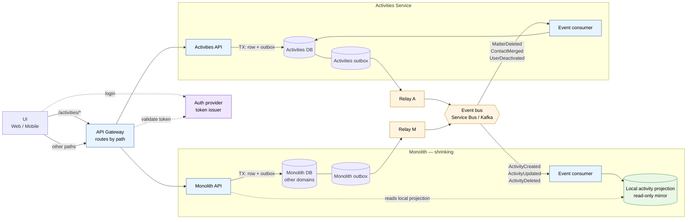
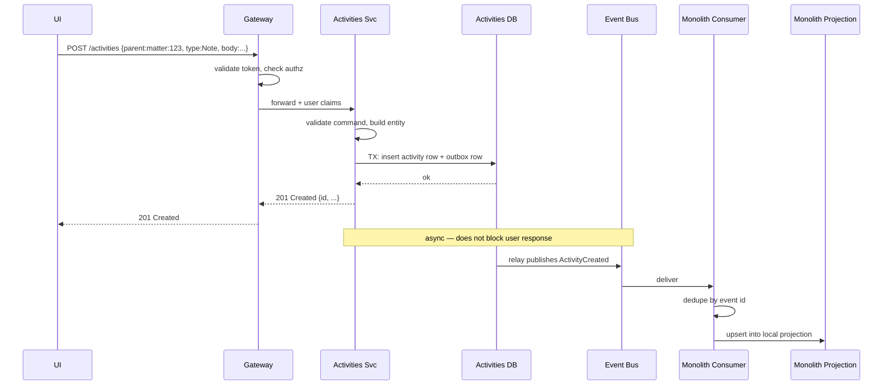
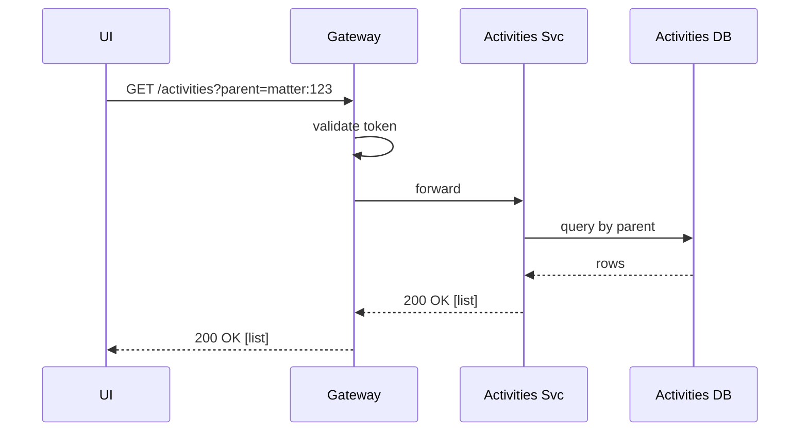
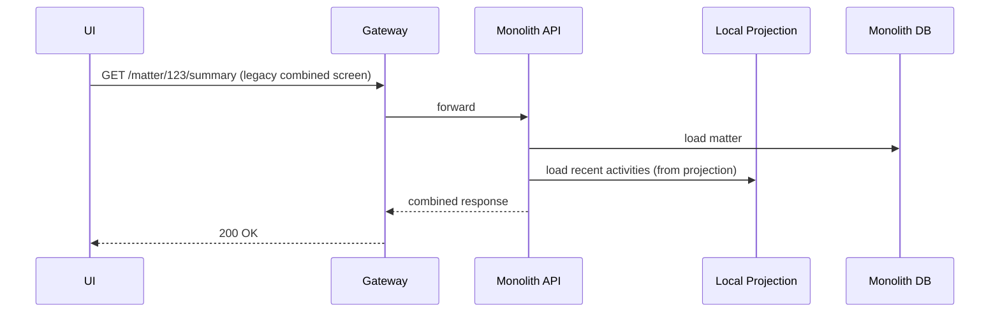
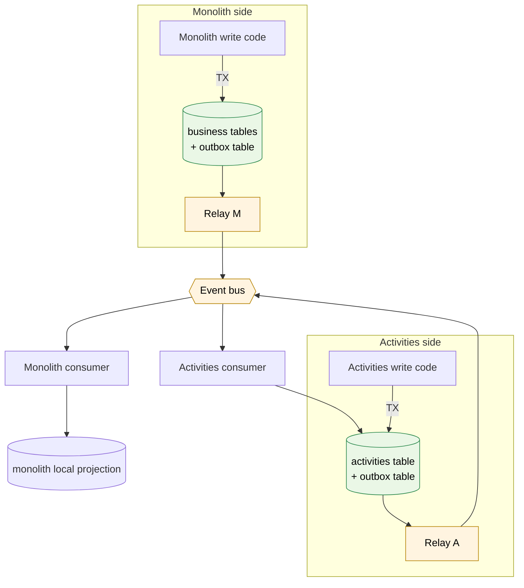

# Full End-State Picture

The architecture after the Activities extraction is complete: UI calls the Activities service directly, the service owns its data, and the monolith and Activities service exchange events as peers.

## The full picture

## Key properties of the end-state

1. **UI knows one URL.** The gateway hides the service split. UI doesn't know which service answers which path.
2. **Each side owns its writes.** Activities svc writes to Activities DB. Monolith writes to monolith DB. No cross-service writes ever.
3. **Each side has its own outbox.** Both producers and consumers. Symmetric pattern.
4. **No synchronous service-to-service calls in the hot path.** Monolith reads a local projection (kept fresh by the bus), not the Activities API. This is the rule that makes failures *partial* instead of *total*.
5. **Auth is shared.** Both services trust the same token issuer. The gateway validates once.

## Write flow — UI creates an activity

Two properties to notice:

- **User response returns at the local DB commit.** Doesn't wait for the event to be published, doesn't wait for the monolith to process it. p95 latency is roughly the Activities DB write time.
- **Eventual consistency is bounded.** The lag between "activity written" and "monolith projection updated" is typically sub-second under normal load. Plan for it being 10+ seconds during incidents.

## Read flow — UI lists activities

Plain. No event bus involved. Reads are direct and synchronous.

## Read flow — Monolith screen needs activities

The monolith does **not** call the Activities API here. It reads its local projection, which the bus keeps fresh. This is what makes the monolith resilient to Activities svc downtime.

## Reverse event flow — events the Activities service consumes

The Activities service isn't just a producer. It needs to react to things happening elsewhere:

| Event from monolith | Activities svc reaction |
|---|---|
| `MatterDeleted` | Soft-delete or hard-delete activities for that matter, per retention policy |
| `MatterMerged(from, to)` | Reparent activities from `from` to `to` |
| `ContactMerged(from, to)` | Same — update parent ref |
| `UserDeactivated` | Update activities' `created_by` display metadata; keep activities themselves |
| `TenantSuspended` | Reject new writes for that tenant; existing data untouched |

The pattern is symmetric. Both sides publish events about their own aggregates. Both sides consume events about other aggregates they reference.

## The two outboxes

Same pattern, mirrored. Both sides:

- Write business row + outbox row in one local transaction.
- Have a relay that publishes the outbox to the bus.
- Have a consumer that reacts to events from the other side.

No exotic infrastructure — just the same building blocks twice.

## Gateway responsibilities

Keep the gateway dumb:

| Concern | Gateway | Service |
|---|---|---|
| Path routing | yes | no |
| TLS termination | yes | no |
| Auth token validation | yes | no |
| Authorization (RBAC, tenancy) | no — pass claims through | yes |
| Rate limiting | yes (coarse, per tenant) | yes (fine, per endpoint) |
| Request/response transformation | no | n/a |
| Business logic | never | yes |

If the gateway starts holding business logic, it becomes a second monolith. Resist.

Concrete options: Azure API Management, Azure Front Door with rules, NGINX, Kong, YARP (for .NET-hosted gateway). For a SQL Server / .NET shop, **YARP** is the lightest-weight option and runs as a normal ASP.NET service.

## Failure modes

| Scenario | Effect | Recovery |
|---|---|---|
| Activities svc down | `/activities/*` returns 5xx. Monolith screens that use local projection still work — they show last-known activity data. | Restart svc; outbox unchanged; no data lost. |
| Activities DB down | Writes fail at the gateway-svc hop. Cached projection in monolith still serves reads. | DB recovery; outbox keeps stale events queued; relay drains when DB returns. |
| Event bus down | Local writes still succeed (the local TX doesn't depend on the bus). Outboxes back up. Cross-service views go stale. | Bus recovery; relays drain backlogs in FIFO order; eventual consistency restored. |
| Monolith down | Legacy screens fail. Activities screens unaffected — UI calls Activities svc through gateway. | Monolith recovery; its consumer drains backlog and catches up its projection. |
| Gateway down | Everything fails (same as monolith-only era — auth was always SPOF). | Gateway recovery. Run multi-instance behind LB. |
| Auth provider down | Tokens can't be refreshed; new logins fail; existing sessions work until token expiry. | Auth recovery. Unchanged from before. |
| Relay falls behind | No data lost; events delayed. Monolith projection stale. | Scale relay horizontally; partition by tenant or aggregate id. |
| Poison message in bus | Consumer keeps retrying same message, blocks queue. | Dead-letter queue; alert on DLQ depth; replay after fix. |

The headline win: **a service outage is a feature outage, not a system outage**. With the monolith-only architecture, a DB hiccup took everything down. Now activity problems don't affect billing; billing problems don't affect activity logging.

## What's no longer in the monolith

After the cutover completes:

- `dbo.Activities` table → dropped (after retention window)
- `dbo.ActivitiesController` → deleted
- `MonolithActivityService` impl → deleted
- `IActivityService` interface → deleted (or moved to a shared contracts package if other code uses it)
- The feature flag `activities.useNew` → removed
- The `OldImpl/NewImpl` plumbing → all gone

What remains in the monolith:

- The local activity projection (kept fresh by events). Read-only.
- An event consumer that maintains the projection.
- Outbox-side: emits `MatterDeleted`, `ContactMerged`, etc., so Activities svc can react.

## What changes for clients

| Client | Before | After |
|---|---|---|
| Web UI | One base URL → monolith | One base URL → gateway → routed |
| Mobile | Same | Same |
| Third-party API consumers | Monolith API | Gateway publishes the same surface, can route per-path. Their URLs change once, then never again. |
| Internal scripts / cron jobs | Direct DB or monolith API | Activities svc API (with API keys / service tokens) |
| Reporting / BI | SQL against monolith DB | Warehouse fed by CDC from both sides (separate concern, plan separately) |

## Migration is reversible up to a point

The point of no return is **dropping the monolith Activities tables**. Up until that step, every phase is reversible:

- Stage 1 reads through monolith → flip flag back, all reads return to old impl
- Stage 1 writes through monolith → flip flag back, all writes return to old impl
- Stage 2 UI direct calls → gateway rule reverted, UI sees no change
- Final cleanup of monolith code → only do this after months of stability and a confirmed retention window

This is why **stage 6 / step 7 of the rollout sits far apart from the rest in time**. The plumbing migration is one project; the cleanup is a separate decision made later, with confidence built up from production data.

## Bringing this back to the rollout

Mapping back to the 7-step rollout in `03-activities-extraction.md`:

| Rollout step | End-state property added |
|---|---|
| 1. Interface seam | Reversibility, no behavior change |
| 2. Outbox + relay (monolith side) | Monolith publishes events |
| 3. Activities svc + consumer | Activities DB stays current |
| 4. NewImpl | Routing target exists |
| 5. Flip reads | UI still hits monolith; monolith forwards | (Stage 1 reads) |
| 6. Flip writes | Activities svc owns writes; monolith reads local projection | (Stage 1 writes) |
| **6.5 Gateway routes** | **UI calls Activities svc directly** | **(Stage 2)** |
| 7. Cleanup | Monolith Activities code removed |

Stage 2 (gateway routes) is technically a separate step inserted between 6 and 7. The earlier rollout doc collapsed it into step 7; in practice they happen at different times and have different risk profiles.
