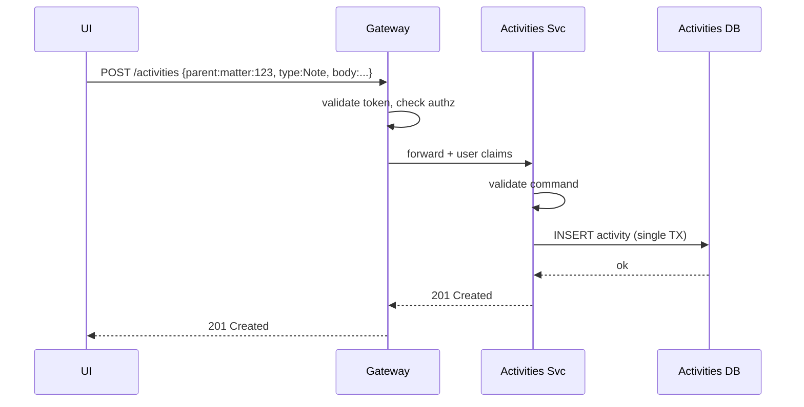
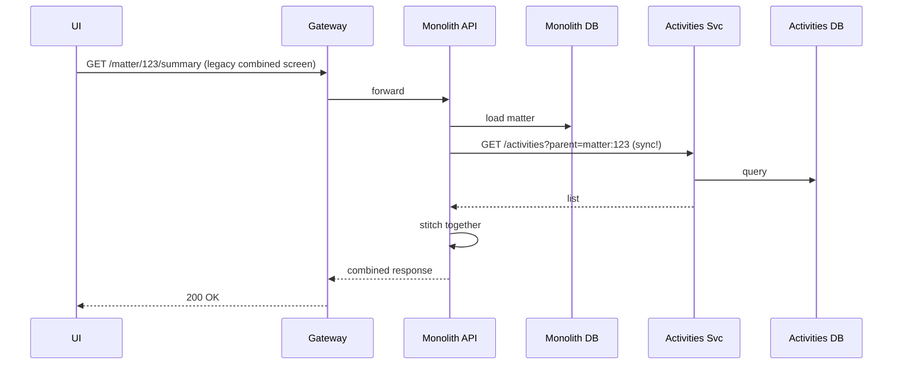
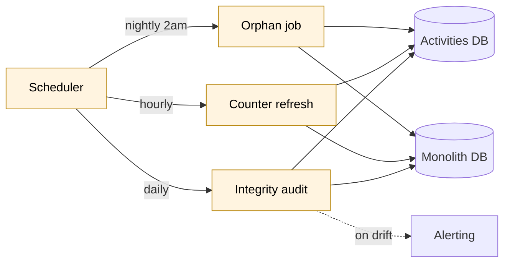
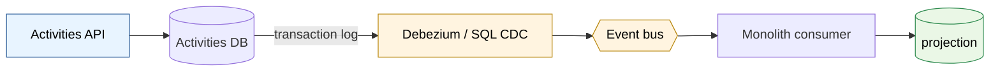

# End-State, Option 2 — Without Outbox

The same goal as `04-end-state.md` — Activities extracted, UI calls the service directly, Activities owns its own data — but with no outbox table, no event bus for activity changes, and no projection in the monolith. Just **synchronous calls** between services, plus a **periodic reconciliation job** for any derived state the monolith really needs.

Think of it as the "simpler, more coupled" version of the same end-state.

## The full picture

```mermaid
flowchart LR
    UI[UI<br/>Web / Mobile]
    GW[API Gateway<br/>routes by path]
    Auth[Auth provider]

    subgraph Mono[Monolith — shrinking]
      direction TB
      MAPI[Monolith API]
      MDB[(Monolith DB<br/>other domains)]
    end

    subgraph Svc[Activities Service]
      direction TB
      AAPI[Activities API]
      ADB[(Activities DB)]
    end

    Recon[Reconciliation job<br/>nightly / hourly]

    UI -->|"/activities/*"| GW
    UI -->|other paths| GW
    UI -.->|login| Auth
    GW -.->|validate token| Auth

    GW --> AAPI
    GW --> MAPI

    AAPI --> ADB
    MAPI --> MDB

    MAPI -->|sync HTTP/gRPC<br/>when activity data needed| AAPI
    AAPI -.->|sync HTTP, rarely<br/>e.g. validate parent ref| MAPI

    Recon -->|scan + reconcile| ADB
    Recon -->|cross-check| MDB

    classDef ok fill:#e8f4ff,stroke:#2c5d99,color:#000
    classDef auth fill:#f0e6ff,stroke:#6a3eaa,color:#000
    classDef job fill:#fff4e0,stroke:#b8860b,color:#000
    class MAPI,AAPI,GW ok
    class Auth auth
    class Recon job
```

Notice what's *gone* compared to Option 1:

- No `Outbox` tables
- No `Relay` workers
- No event bus
- No local activity projection in the monolith
- No event consumers

Notice what's *new*:

- A synchronous arrow from monolith → Activities API (when monolith screens need activities)
- A reconciliation job (covers anything that previously relied on events)

## Write flow — UI creates an activity

Cleaner than Option 1's write — no outbox row, no relay, no event publication. The activity exists in the Activities DB, and **that's it**. Nothing else in the system needs to know synchronously.

## Read flow — monolith screen needs activities

This is the flow that changes most vs. Option 1.

The monolith calls Activities **synchronously, in the request hot path**. There's no local projection — the source of truth is the Activities service.

This is the key trade-off of Option 2: **simpler infrastructure, tighter runtime coupling.**

## Reconciliation — the substitute for events

A scheduled job replaces the event-driven sync that Option 1 has. Examples:

| Job | Purpose | Frequency |
|---|---|---|
| Orphan check | Find activities whose parent (matter, contact) no longer exists in monolith. Soft-delete or flag. | Nightly |
| Counter refresh | Update "activity count" denormalized columns the monolith may still display. | Hourly |
| Data integrity audit | Compare counts/sums between Activities DB and any cached aggregates. Alert on drift. | Daily |
| Search index rebuild | If a search index exists, refresh from Activities DB. | Hourly or on-demand |

These run independently. They don't need to be perfect; they just bound the staleness window.

## Pros and cons vs. Option 1

| Aspect | Option 1 (with outbox) | Option 2 (no outbox) |
|---|---|---|
| **Infrastructure pieces** | bus + 2 outboxes + 2 relays + 2 consumers + projection | sync HTTP + 1 scheduled job |
| **New ops surface** | bus tuning, DLQ, partition lag, relay scaling | job scheduling, retry, alerting |
| **Consistency for monolith reads** | eventually consistent (sub-second to seconds) | strongly consistent (always current) |
| **Activities svc down → monolith** | screens still show *stale* activity data from projection | screens that show activities **fail** |
| **Monolith down → Activities svc** | unaffected | mostly unaffected (rare callbacks to monolith fail) |
| **Hot-path latency** (combined screens) | low — local projection read | one extra network hop per screen |
| **Read scale** | trivially scales — monolith reads local | every monolith read = Activities API call |
| **New consumer of activity events** (search, BI, etc.) | subscribe to bus | not possible without rebuilding — add CDC or bus later |
| **Replay / rebuild** | replay outbox or events | rebuild from Activities DB directly; no event history |
| **Audit trail of "what changed when"** | events are a natural log | need a separate audit table inside Activities svc |
| **Team operational maturity needed** | bus + async patterns | basic HTTP services + cron |
| **Where bugs hide** | in event ordering, idempotency, projection lag | in retry logic, timeouts, cascading failures |

## When Option 2 is the right call

Pick this when **all** of these apply:

1. **Activities is mostly self-contained.** The monolith rarely needs activity data on its own screens. If 90% of activity reads come through the UI directly to Activities svc, the cross-service sync cost is small.
2. **No third party needs activity events.** If only the monolith would consume events, and the monolith would consume them rarely, the bus is overhead.
3. **Team doesn't have bus/event experience.** Operating Kafka or Service Bus well is a real skill. If you don't have it, synchronous calls + a cron job are far less risky.
4. **Strong consistency matters more than independence.** If "the monolith must never show stale activity data" is a firm requirement, synchronous reads guarantee it.
5. **Activities svc has plausible high availability.** If you can run it on three nodes with a managed DB, "monolith depends on Activities svc" is acceptable. If Activities svc is a janky pet, it isn't.

**Pick Option 1 instead when:**

- Multiple consumers will want activity events (search, BI, notifications, audit).
- The monolith displays activities on lots of screens (so per-screen sync calls add up).
- You need the monolith and Activities svc to be able to fail independently.
- You're already operating an event bus for other reasons.

## Variant — CDC instead of outbox (still event-driven)

If you want events but don't want to touch the Activities service to add an outbox table, you can use **CDC on the Activities DB** as the pipe. The Activities service writes plainly to its DB; a CDC connector reads the transaction log and publishes events.

This is a **middle option** — has events, has the monolith projection, has resilience benefits of Option 1, but the Activities service code stays simpler (no outbox writes). Trade-off: events are row-shaped (table columns), not domain-shaped (`ActivityCreated`). You're coupling consumers to the Activities DB schema.

CDC is the right pick when you want events but really don't want the Activities service code to have to think about them. The Activities service can pretend it's a normal database-backed service; the CDC layer turns its writes into events transparently.

## Failure modes (Option 2)

| Scenario | Effect | Recovery |
|---|---|---|
| Activities svc down | Direct `/activities/*` calls fail. Monolith combined screens fail (where they call Activities). Monolith-only screens unaffected. | Restart svc. No event backlog to drain. Service comes back, things work. |
| Activities DB down | Same as above. | DB recovery. |
| Network blip monolith → Activities svc | Combined-screen requests fail or time out. UI may show partial data. | Retries; circuit breaker on monolith side prevents cascade. |
| Monolith down | Most things fail (legacy domains). Activities svc API still works for UI direct calls. | Monolith recovery. |
| Gateway down | Everything fails. | Gateway recovery; run multi-instance. |
| Reconciliation job fails | Drift in derived state goes uncaught until next run. | Job recovery; alerting on missed runs. |
| Slow Activities svc | Monolith combined screens slow down too (sync calls block). | Capacity; circuit breaker; per-call timeouts. |

The headline difference vs. Option 1: **failures cascade more easily.** A slow or down Activities service degrades the monolith's combined screens directly, instead of just causing the monolith's view to go stale.

## Mitigations for the synchronous coupling

If you go with Option 2 and the synchronous coupling worries you, three concrete mitigations:

1. **Circuit breaker on monolith → Activities calls.** When the call fails repeatedly, stop calling for a cooldown period and serve the combined screen without activities (with a "couldn't load" indicator). Polly does this for free in .NET.
2. **Short timeouts, no retries in the hot path.** 500ms timeout, no retry. Fail fast so the parent screen doesn't hang. Retries belong in the reconciliation job, not the hot path.
3. **A small TTL cache on the monolith side.** Not a projection — just a 30-second in-memory cache of recent Activities API responses. Hides momentary blips, takes the load off Activities svc. Stale-while-revalidate, not authoritative.

These don't turn Option 2 into Option 1 — they just blunt the worst-case cascades.

## When to start with Option 2 and migrate to Option 1 later

Genuinely common path. **Start with Option 2** (no outbox, sync calls) because the day-one infrastructure is smaller. **Migrate to Option 1** later if:

- A third consumer wants activity events (search index, BI pipeline, mobile push notifications).
- Sync calls become a measurable bottleneck.
- Activities svc availability becomes a problem for the monolith.

Going Option 2 → Option 1 is a real but **bounded** project:

1. Add an outbox table to the Activities service.
2. Modify the service to write outbox rows alongside business rows.
3. Add a relay.
4. Pick a bus.
5. Build the monolith's consumer and local projection.
6. Switch the monolith's combined screens from "call Activities API" to "read local projection."

That's ~6 weeks of work, but it's incremental — at no point are you redoing the extraction. You're just upgrading the pipe between the two services.

## Summary

| | Option 1 (with outbox) | Option 2 (without outbox) |
|---|---|---|
| Pipe between services | Event bus + outboxes | Synchronous HTTP/gRPC |
| Monolith stays in sync via | Local projection from events | Sync calls on demand |
| Day-1 infra cost | Higher | Lower |
| Day-1 ops surface | Bus, relays, consumers | Just HTTP + cron |
| Decoupling | Strong | Moderate |
| Consistency for monolith reads | Eventual (seconds) | Strong (sync) |
| Resilience to peer failure | Good | Coupled |
| Future event consumers | Cheap to add | Expensive (need to add bus) |
| Operational maturity required | Bus / async patterns | Basic HTTP services |
| **Best for** | Lots of cross-service interaction, multiple consumers, independent failure | Mostly-isolated services, small team, simpler infra |

Neither is "the right answer" universally. **For a first extraction on a team that hasn't done microservices before, Option 2 is often the right starting point** — it gets the extraction done with less infrastructure, and you can layer events on later if the system grows in a direction that needs them.
