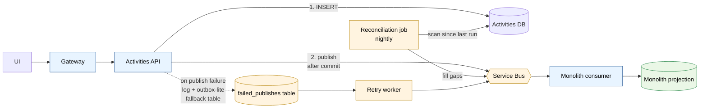
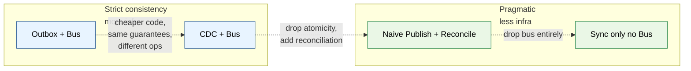

# End-State, Option 3 — Service Bus, No Outbox

You want async events on Service Bus to keep the monolith projection fresh, but you don't want the outbox table + relay + dual-write inside the application. Two real patterns achieve this.

## The atomicity problem (reminder)

The whole reason for the outbox is that this naive code is broken:

```csharp
db.Save(activity);                       // (1) DB write
bus.Publish(new ActivityCreated(...));   // (2) bus publish
```

If (1) succeeds and (2) fails → lost event. Application crashes between them → lost event. There's no atomic "DB + bus" transaction across two systems.

Outbox solves it by making (1) and a *durable record of (2)* one local transaction. Without an outbox, you need a different answer to the atomicity question:

- **Pattern A — CDC → Service Bus.** Read the DB's transaction log; the log *is* the durable record. No application changes.
- **Pattern B — Naive publish + reconciliation.** Publish after commit, accept rare loss, catch drift with a periodic job.

## Pattern A — CDC → Service Bus

The Activities service writes to its DB normally — no outbox table, no event code. A separate **CDC reader** tails the database's transaction log and publishes events to Service Bus.

```mermaid
flowchart LR
    UI[UI] --> GW[Gateway] --> AAPI[Activities API]
    AAPI -->|plain INSERT/UPDATE| ADB[(Activities DB)]

    ADB -->|SQL Server CDC tables<br/>or transaction log| CDC[CDC reader<br/>Debezium / custom worker]
    CDC --> SB{{Azure Service Bus<br/>topic: activities.events}}
    SB --> MC[Monolith consumer] --> MProj[(Monolith local projection)]

    classDef ok fill:#e8f4ff,stroke:#2c5d99,color:#000
    classDef pipe fill:#fff4e0,stroke:#b8860b,color:#000
    classDef proj fill:#eaf7e6,stroke:#2d8a4e,color:#000
    class AAPI,GW,MC ok
    class CDC,SB pipe
    class MProj proj
```



### How CDC works on SQL Server

SQL Server has two built-in options:

| Mechanism | What it captures | Cost |
|---|---|---|
| **Change Tracking (CT)** | Which rows changed, not the values | Light; no extra storage |
| **Change Data Capture (CDC)** | Full before/after row state, change type | Heavier; populates `cdc.dbo_<table>_CT` tables |

For event publishing you almost always want **CDC**, because consumers need the values.

```sql
-- enable CDC at DB level (once)
EXEC sys.sp_cdc_enable_db;

-- enable CDC on the Activities table
EXEC sys.sp_cdc_enable_table
    @source_schema = 'dbo',
    @source_name = 'Activities',
    @role_name = NULL;
```

Now every change to `dbo.Activities` is asynchronously written to `cdc.dbo_Activities_CT` by a SQL Agent job. Your CDC reader polls that table:

```sql
SELECT __$start_lsn, __$operation, Id, TenantId, ParentId, Type, Subject, ...
FROM cdc.dbo_Activities_CT
WHERE __$start_lsn > @last_processed_lsn
ORDER BY __$start_lsn;
```

`__$operation` tells you the kind: 1 = delete, 2 = insert, 3 = update-before, 4 = update-after.

### The CDC reader options

| Option | Notes |
|---|---|
| **Debezium SQL Server connector + Kafka Connect** | Industry standard. Kafka-native. Bridges to Service Bus need an extra connector or KafkaConnect → ASB shim. Heavy dependency if you don't already have Kafka. |
| **Custom .NET worker polling `cdc.*_CT` tables** | A few hundred lines of code. Tracks last LSN per table in its own state table. Publishes directly to Service Bus. **Usually the right call for an Azure / .NET shop.** |
| **Azure Data Factory / Event Grid SQL trigger** | Works for low volume; latency tens of seconds; cost adds up. Not recommended for write-heavy services. |

Custom worker sketch:

```csharp
while (running) {
    var rows = db.Query(@"
        SELECT TOP 100 __$start_lsn, __$operation, Id, ParentId, Type, ...
        FROM cdc.dbo_Activities_CT
        WHERE __$start_lsn > @last
        ORDER BY __$start_lsn", new { last = state.LastLsn });

    foreach (var r in rows) {
        var evt = MapRowToEvent(r);                 // shape: ActivityCreated / Updated / Deleted
        await serviceBus.SendAsync(evt, new ServiceBusMessage {
            MessageId = $"{r.Id}-{r.__$start_lsn}", // dedupe key
            SessionId = r.TenantId,                  // ordering per tenant
        });
        state.LastLsn = r.__$start_lsn;
    }

    db.Execute("UPDATE CdcState SET LastLsn = @lsn WHERE Stream = 'Activities'", state.LastLsn);
    if (!rows.Any()) await Task.Delay(500);
}
```

Three things this gives you for free:

1. **Atomicity** — because `cdc.*_CT` is populated *by SQL Server itself* in lockstep with the original transaction. No race, no dual-write.
2. **At-least-once delivery** — if the worker crashes mid-publish, on restart it re-reads from `LastLsn` and re-publishes. Service Bus `MessageId` enables dedupe.
3. **Replay** — drop `LastLsn` back to a known point, the worker replays.

### Pros / cons of CDC

| Aspect | CDC + Service Bus |
|---|---|
| Activities service code | Unchanged — no outbox, no event publishing logic |
| Atomicity | Yes (transaction log is source of truth) |
| Event shape | **Row-shaped** — `__$operation` + column values. Coupled to table schema. |
| Schema changes | Each column add/rename ripples to event consumers — versioning needed |
| Domain semantics | Lost — `INSERT into Activities` is not the same as `ActivityCreated` (no command context, no actor, no reason) |
| Ops surface | CDC must be enabled and maintained; SQL Agent job must be healthy; CDC retention configured |
| Latency | Sub-second once the CDC worker is running |
| Cost | CDC adds DB load (~10–20% on write-heavy tables); storage for `cdc.*_CT` tables |
| Maturity needed | Low if you write your own polling worker; high if you adopt Debezium |

**When to pick CDC:**

- You want the Activities service code to stay "just a normal CRUD service."
- Row-shaped events are acceptable (consumers can live with `{operation: 'insert', columns: {...}}`).
- You're on SQL Server (Postgres logical replication is the equivalent; same idea).
- You don't already have an event publishing convention.

**When to skip CDC:**

- You want clean domain events (`ActivityCreated` with actor, reason, idempotency key, etc.).
- The team has no SQL CDC operational experience and doesn't want to learn.
- The Activities DB is on a managed service where CDC isn't trivial to enable.

## Pattern B — Naive Publish + Reconciliation

Application publishes to Service Bus directly after committing the DB transaction. Accept rare loss. Cover the loss with a periodic reconciliation job that detects drift.



### The write flow

```csharp
async Task<Activity> Create(CreateActivityCommand cmd) {
    var activity = BuildEntity(cmd);

    using var tx = await db.BeginTransactionAsync();
    await db.InsertActivityAsync(activity);
    await tx.CommitAsync();   // (1) DB committed — point of no return

    try {
        await serviceBus.SendAsync(new ActivityCreated(activity)); // (2)
    } catch (Exception ex) {
        logger.LogError(ex, "publish failed for {ActivityId}", activity.Id);
        await db.InsertFailedPublishAsync(activity.Id, "ActivityCreated"); // local fallback
    }

    return activity;
}
```

Three failure scenarios and what happens:

| Failure | Result | Recovery |
|---|---|---|
| DB write fails | No row, no event. User sees error. | User retries; normal. |
| DB write succeeds, app crashes before publish | Row exists, event lost. | Reconciliation catches it. |
| DB write succeeds, publish fails | Row exists, event lost, fallback row written. | Retry worker drains `failed_publishes`. |
| DB write + publish both succeed | Normal case. | — |

The `failed_publishes` table is **outbox-lite** — but only for the unhappy path. The happy path bypasses it entirely. That's the architectural difference: outbox writes to the buffer table always; this writes to it only on failure.

### The reconciliation job

Runs nightly or hourly, scans for any activity not represented in events:

```csharp
// Nightly job
async Task Run() {
    var since = state.LastReconciledAt;
    var until = DateTimeOffset.UtcNow.AddMinutes(-5); // grace window

    var rows = await db.QueryAsync(@"
        SELECT Id, TenantId, ParentId, Type, Subject, CreatedAt, UpdatedAt
        FROM Activities
        WHERE UpdatedAt > @since AND UpdatedAt < @until
        ORDER BY UpdatedAt", new { since });

    foreach (var r in rows) {
        // republish as a 'reconciliation' event — consumers should be idempotent and ignore if already seen
        await serviceBus.SendAsync(new ActivityReconciled(r), new ServiceBusMessage {
            MessageId = $"recon-{r.Id}-{r.UpdatedAt:O}",
            ApplicationProperties = { ["origin"] = "reconciliation" }
        });
    }

    state.LastReconciledAt = until;
}
```

The consumer dedupes by `(activityId, lastModified)` or by event MessageId. The reconciliation just makes sure no row is invisible to the bus forever.

### Pros / cons of naive publish + reconciliation

| Aspect | Naive publish + reconciliation |
|---|---|
| Activities service code | Adds publish call (one line) + failure fallback. Simple. |
| Atomicity | **No** — small window of inconsistency between DB commit and publish |
| Event loss | Rare, recoverable via reconciliation |
| Event shape | Whatever you want — domain events, clean payloads |
| Domain semantics | Preserved — your code controls event content |
| Ops surface | Just the reconciliation job + monitoring on `failed_publishes` table depth |
| Latency | Same as outbox once published; reconciliation lag for missed events |
| Replay | Possible — re-run reconciliation with `since = 0` to republish everything |
| When OK | Consumers are idempotent and can tolerate occasional late event |
| When not OK | Strict "every event must arrive in order in real time" requirements |

## Three-way comparison

| | Outbox (`04-end-state.md`) | CDC (Pattern A) | Naive + Reconcile (Pattern B) |
|---|---|---|---|
| **App code change** | Adds outbox writes everywhere | None | One publish call + fallback |
| **Atomicity guarantee** | Strict | Strict (via log) | Best-effort |
| **Event shape** | Domain events | Row-shaped | Domain events |
| **Schema coupling** | Loose (events are contract) | Tight (events are rows) | Loose |
| **Ordering** | Per aggregate via partition | Per LSN | Best-effort |
| **Loss window** | None | None | Seconds, rare |
| **Replay** | From outbox table | From any LSN | From reconciliation |
| **Ops pieces to run** | Outbox table, relay, bus | CDC enabled, CDC reader, bus | Bus, reconciliation cron, failed_publishes table |
| **Where bugs hide** | Relay correctness, ordering | CDC retention, schema drift | Reconciliation correctness, idempotency |
| **Maturity needed** | Medium | Medium-high (CDC tooling) | Low |
| **Best for** | Many consumers, strict guarantees | Don't want to touch service code | Few consumers, OK with eventual cleanup |

## My recommendation for your situation

Given you said no outbox but you want Service Bus, and the stack is .NET on Azure:

### Default: **Pattern B — naive publish + reconciliation**

- Smallest blast radius. One line in `Create`/`Update`/`Delete` to publish.
- Domain events stay clean.
- Reconciliation job is ~50 lines of code.
- No new infra beyond Service Bus (which you're adding anyway).
- Easy to upgrade to outbox later if loss tolerance changes — the events stay the same shape, only the publish path changes.

### Pick CDC instead when:

- The Activities service is large and "add a publish call after every write" would touch dozens of code paths.
- The team is comfortable enabling and operating SQL CDC.
- Row-shaped events are acceptable for your consumers (only one consumer = the monolith projection, which is the easy case).

### Don't:

- Don't use Service Bus's old `TransactionScope` / MSDTC integration. Cross-resource distributed transactions are deprecated in Azure and brittle.
- Don't publish *before* the DB commit. You can get phantom events for transactions that rolled back.
- Don't skip the reconciliation job in Pattern B. Without it, lost events stay lost — there's no audit.

## Visualizing the trade-off



Each step right is less infrastructure. Each step left is more guarantees. **Pattern B sits at the sweet spot for a first extraction** where you want async events and decoupling, but don't yet need military-grade durability and don't want to build an outbox/relay.

## Failure modes (Pattern B, the recommended one)

| Scenario | Effect | Mitigation |
|---|---|---|
| Service Bus down | Publish fails; fallback row written to `failed_publishes`; user response succeeds (DB was committed). | Retry worker drains fallback when bus recovers. Monolith projection lags. |
| App crashes after DB commit, before publish | Same as bus-down for that one event. | Reconciliation catches it on next run. |
| Reconciliation job missed a run | Drift in projection up to one extra cycle. | Alert on job heartbeat; run more frequently if drift matters. |
| Consumer down for hours | Bus retains messages (configure long TTL); consumer drains backlog on return. | Service Bus default TTL = 14 days; tune as needed. |
| Poison message at consumer | Goes to DLQ. Subsequent messages OK. | Alert on DLQ depth; replay after fix. |
| Duplicate event from retry | Consumer dedupes by `MessageId`. | Service Bus duplicate detection (5–10 min window) + consumer-side dedupe table. |

## Summary

- **You can absolutely have Service Bus without an outbox.** Two real patterns: CDC, or naive publish + reconciliation.
- **For a first extraction on .NET + Azure SQL, naive publish + reconciliation is the pragmatic default.** Smallest infra, simplest code, clean domain events, recoverable failure modes.
- **CDC is the right pick if you don't want to modify the service at all** — and you accept row-shaped events tied to your table schema.
- **Strict outbox is the right pick if you have multiple consumers and lost events are not acceptable.** Defer this until you actually have a second consumer.
- All three are migration paths from each other: Pattern B → CDC, Pattern B → Outbox, etc. None is a dead end.
