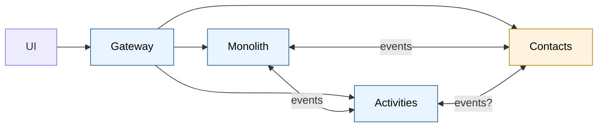
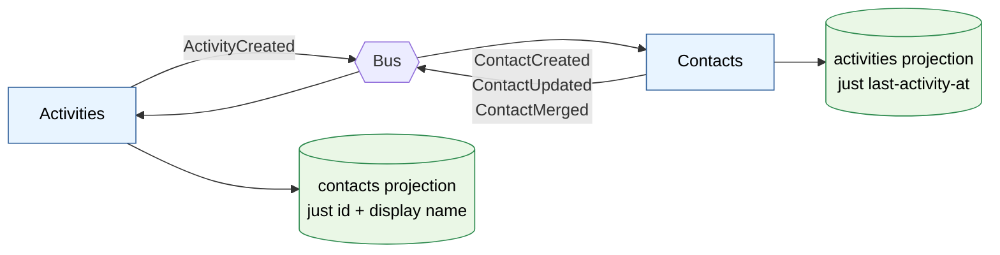
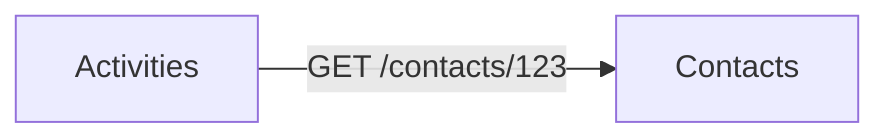
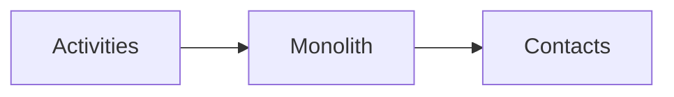
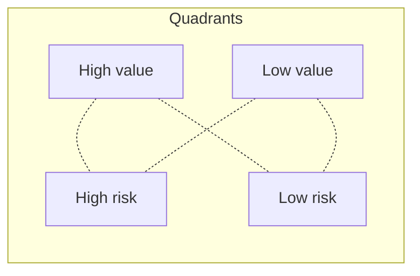
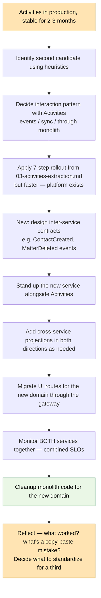

# The Second Extraction

What changes when you extract a second microservice (e.g., Contacts) after Activities is in production. This is where the strangler fig pattern either pays off or starts to wobble.

## The headline shift

The first extraction is **mostly platform work** with a service on top. The second is **mostly service work** on top of an existing platform. The cost profiles are very different:

```mermaid
flowchart LR
    subgraph First[First extraction — Activities]
      direction TB
      F1[Gateway: build]
      F2[Auth integration: build]
      F3[Bus / events: build]
      F4[CI/CD pipeline: build]
      F5[Observability: build]
      F6[Service template: build]
      F7[On-call practices: build]
      F8[Activities domain: build]
    end

    subgraph Second[Second extraction — Contacts]
      direction TB
      S1[Gateway: add route]
      S2[Auth integration: reuse]
      S3[Bus / events: add topic]
      S4[CI/CD: clone pipeline]
      S5[Observability: clone dashboards]
      S6[Service template: instantiate]
      S7[On-call: extend rotation]
      S8[Contacts domain: build]
      S9[Activities ↔ Contacts interaction: NEW]
    end

    First --> Second

    classDef build fill:#fde2e2,stroke:#c0392b,color:#000
    classDef reuse fill:#eaf7e6,stroke:#2d8a4e,color:#000
    classDef new fill:#fff4e0,stroke:#b8860b,color:#000
    class F1,F2,F3,F4,F5,F6,F7,F8 build
    class S1,S2,S3,S4,S5,S6,S7,S8 reuse
    class S9 new
```



The first extraction has eight things to build. The second has one thing to build (the domain), seven things to **reuse**, and one new category that didn't exist before: **service-to-service interaction**. That last item is where the second extraction gets interesting.

## What you reuse (the infrastructure dividend)

Things you built once for Activities that the second service inherits at near-zero cost:

| Component | Cost for 1st | Cost for 2nd |
|---|---|---|
| API gateway | weeks (pick, deploy, configure auth, routing) | minutes (add a path rule) |
| Auth/identity integration | weeks (token validation, claims propagation) | hours (config) |
| Service Bus / event infrastructure | weeks (topics, subscriptions, DLQ, retries, monitoring) | hours (new topic + subscription) |
| Service template (Dockerfile, health checks, logging, metrics, tracing) | days | minutes (clone) |
| CI/CD pipeline | days | hours (clone + adjust) |
| Observability dashboards (request rate, latency, errors, saturation) | days | hours (clone with new service name) |
| On-call runbook structure | days | hours (write the service-specific bits) |
| Branch-by-abstraction pattern in the monolith | days | hours (apply to new domain) |
| Event publishing pattern (outbox / CDC / naive — whichever you picked) | days | hours (same pattern, new events) |
| Schema/contract registry conventions | days | hours (add new schemas) |
| Database migration tooling | days | hours (same tool, new DB) |

**The leverage point:** if the first extraction took six months, the second should take 6–10 weeks for comparable scope. If it doesn't, your "platform" isn't actually a platform yet — it's a one-off that happens to host Activities.

## What's genuinely new — service-to-service relationships

Before: one boundary (monolith ↔ Activities).
After: three boundaries.



Three new questions appear that didn't exist with one service:

1. **Does Activities need data from Contacts?** (Probably yes — activities reference contacts.)
2. **Does Contacts need data from Activities?** (Maybe — "last activity at" on a contact.)
3. **Do the two services talk directly, or through the monolith, or via events only?**

There are three patterns, in order of preference:

### Pattern 1 — Pure event-driven (preferred)

Each service publishes its own domain events. Other services subscribe and keep their own local projection of what they need.



- **Pros:** No synchronous coupling. Either service can be down without breaking the other for reads. Scales to N services.
- **Cons:** Eventual consistency. Each service needs a tiny projection of "just enough" peer data.
- **Use when:** Default. Always start here.

### Pattern 2 — Synchronous service-to-service (use sparingly)

Activities calls Contacts API directly when it needs current contact data.



- **Pros:** Always current. No projection to maintain.
- **Cons:** Couples Activities' availability to Contacts'. Cascading failures. Latency adds up.
- **Use when:** The data really must be current at read time and stale-by-seconds isn't OK. Rare in CRM-style domains.

### Pattern 3 — Through the monolith (transitional only)

Activities talks to Contacts via the monolith, which still has both projections.



- **Pros:** Doesn't require a direct relationship between the two new services. Sometimes useful in the middle of a migration.
- **Cons:** Reintroduces the monolith as a coupling point. Not a destination, only a way-station.
- **Use when:** The migration sequencing forces it. Plan to remove.

**Rule of thumb:** start with Pattern 1. Add Pattern 2 only when a specific operation genuinely needs synchronous freshness. Avoid Pattern 3 except during transition.

## The cross-service projection pattern

When Activities subscribes to `ContactCreated`/`ContactUpdated`, it doesn't store the full contact. It stores **only what it needs**:

```sql
-- Activities DB
CREATE TABLE contact_refs (
    contact_id      UNIQUEIDENTIFIER PRIMARY KEY,
    tenant_id       UNIQUEIDENTIFIER NOT NULL,
    display_name    NVARCHAR(200) NOT NULL,
    email           NVARCHAR(200),
    updated_at      DATETIME2 NOT NULL,
    INDEX IX_tenant (tenant_id)
);
```

Tiny. Maybe four columns. Just enough to render an activity feed without calling Contacts.

**The invariant:** each service stores the full state of its own aggregates + a *thin* projection of foreign aggregates it references. Resist the temptation to make the projection rich — every column is a maintenance burden.

If a screen needs richer contact data than the projection holds, that's a UI/BFF concern, not a service concern. The gateway or a BFF aggregates two service calls.

## Picking the second candidate

Not all second candidates are equal. Three heuristics:

### Heuristic 1 — pick something that *exercises* the platform

The second extraction is also a **test of your platform decisions**. Pick a domain that:

- Has different volume/shape from Activities (so you discover platform assumptions).
- Has interactions with Activities (so you exercise inter-service patterns).
- Is bounded enough to extract in a reasonable timeframe.

A domain that's *too similar* to Activities (same shape, same volume, same patterns) doesn't teach you anything new. A domain *too different* exposes you to too many unknowns at once.

### Heuristic 2 — minimize cross-service transactional boundaries

Look at the monolith's existing transactions. Where does a single transaction touch multiple aggregates? Those are saga candidates — and the more sagas you have, the harder the extraction.

Good second candidates: **aggregates that are read-joined with the rest of the system but rarely write-coupled.** Contacts and Activities both fit this: you read them together, but transactions usually only mutate one.

Bad second candidates: anything in the **money path** (invoices, payments, trust accounting in a legal system). Money has hard transactional invariants that don't survive naive extraction.

### Heuristic 3 — value vs. risk



| Quadrant | What to do |
|---|---|
| High value, low risk | **Pick this.** Best candidate. |
| High value, high risk | Defer until you have more experience. Tempting but dangerous as second. |
| Low value, low risk | Skip. Not worth the team's attention. |
| Low value, high risk | Definitely skip. |

For most CRM-like monoliths, **Contacts** lands in "high value, low-to-medium risk" and is a strong second candidate.

## The monolith starts visibly shrinking

After two extractions, something psychologically important happens: people start saying "the monolith" instead of "the system." It becomes a part, not the whole. That shift unlocks decisions that were previously off-limits:

- Deleting code that only existed to support Activities/Contacts UI.
- Removing tables once their data has been migrated out.
- Removing background jobs that touched the extracted domains.
- Splitting the monolith's deployment into smaller pieces (now feasible because less is in there).

Document this explicitly. Have a "monolith reduction" tracking metric — table count, controller count, LOC, deploy time. Make the shrinking visible.

## What gets harder

Honest list. Things that were easy with one service get harder with two:

### Cross-service queries

"List all activities for contacts in California" was one SQL query. Now it's a query in two services + a join somewhere. Options:

- **In the UI/BFF:** call Contacts API → get IDs → call Activities API. Slow for large sets.
- **In a projection:** Activities has a `contact_refs` projection with `state` column denormalized from Contacts. Query stays in Activities.
- **In a warehouse:** for reporting-grade queries, push both services' data to a warehouse (via CDC) and query there.

Pick per-query. There's no universal answer.

### Distributed transactions / sagas

"Create activity for new contact" used to be one transaction. Now it's two operations across two services. Saga options:

- **Choreography:** create contact → publish event → Activities sees event → creates activity. Loose, eventual.
- **Orchestration:** a saga orchestrator (in the gateway, BFF, or a dedicated service) calls Contacts, then calls Activities, handles compensation on failure.

Avoid sagas where you can. Redesign UX to not require atomicity across two services — "create contact first, then add the activity in a second step."

### End-to-end testing

You can't `dotnet test` a multi-service flow on one developer's laptop without significant scaffolding. Options:

- **Contract tests** (Pact, similar): each service publishes its contract; other services test against it. Decouples test suites.
- **Test environments**: spin up a full stack on demand (Docker Compose, Tye, K8s namespace). Slow but realistic.
- **Skip E2E in CI**: rely on contract tests + post-deploy smoke tests in a real environment.

### Schema migrations across services

A breaking change to `ContactCreated` event shape now affects every consumer. Versioning becomes mandatory:

- Always **add fields, never rename or remove**, for at least one full release cycle.
- Version the event (`ContactCreated.v2`) when you must break.
- Maintain producers and consumers of multiple versions in parallel until everyone migrates.

This discipline didn't matter with one service. It matters now.

### Reporting and BI

The classic landmine. Reports that joined `Contacts` to `Activities` in SQL now span databases.

Don't try to solve this with cross-DB queries or live cross-service joins. The right answer is almost always **CDC both services into a warehouse/lakehouse and report from there.** That's a separate workstream — plan for it before the second extraction goes live, not after.

## The trap: premature platform-building

After Activities, you have N=1 examples of what a service looks like. It's tempting to:

- Build elaborate service templates with everything anyone might ever need.
- Standardize patterns prematurely.
- Build a "platform team" that owns the bus, gateway, observability.
- Mandate a single language/framework/database for all services.

**Resist.** You don't have enough data to standardize. Apply the rule of three: extract a third service, *then* look at what's actually been duplicated, then standardize the common parts.

The second extraction is for **validating** your pattern, not enshrining it.

## Risk catalogue for the second extraction

| Risk | Symptom | Mitigation |
|---|---|---|
| Copy-paste from Activities even when wrong | New service uses outbox even though sync calls would do | Re-evaluate each pattern decision from scratch for the new domain |
| Inter-service coupling sneaks in | New service synchronously calls Activities API in hot path | Default to events + projections; require justification for sync calls |
| Cross-service joins in UI become latency hell | Pages slow to 3+ seconds | BFF aggregation layer; or denormalized projections |
| Team capacity stretched | On-call burnout, slow incident response | Pause new extractions until the on-call load is acceptable |
| Reporting starts to bit-rot | Old reports break silently | Stand up the warehouse path before extraction completes |
| Monolith ↔ Service A ↔ Service B circular dependencies | A depends on B which depends on monolith which depends on A | Map dependencies; break cycles with events not sync calls |
| Saga creep | More and more workflows need cross-service coordination | UX redesign; merge boundaries if sagas dominate |
| Schema drift between event versions | Consumer breaks because producer changed payload | Contract tests in CI; schema registry; add-don't-rename |

## Recommended sequencing



Two non-negotiable gates:

1. **Don't start the second extraction until the first has been stable in production for a couple of months.** If Activities is still finding bugs, you're not ready. The platform isn't stable yet.
2. **Reflect at the end — what's a real pattern, what's a coincidence?** N=2 lets you start seeing genuine duplication. Standardize *after* the second, not during.

## The "third service" inflection

A note about what comes after:

| Number of services | Character of the work |
|---|---|
| 1 | Building platform + service. ~80% platform, 20% domain. |
| 2 | Validating platform + building service. ~30% platform, 70% domain. |
| 3 | Refining platform + 3rd service. ~20% platform, 80% domain. |
| 4+ | Almost entirely domain work. Platform is steady state. |

The biggest cost transition is **1 → 2**. The biggest organizational transition is **3 → 4** — that's when "platform team" starts to make organizational sense, when previously it was premature.

## Summary

- The second extraction is **mostly leverage** — ~80% of what you built for Activities is reusable.
- The new work is the **service-to-service interaction model**. Default to events + projections; use sync calls sparingly.
- Pick a candidate that **exercises** the platform (different shape from Activities) but is bounded enough to ship.
- Watch for **traps**: premature standardization, copy-paste of patterns that don't fit, latent cross-service coupling.
- Two hard things get harder: **cross-service queries** (BFF or projections) and **schema versioning** (add-don't-rename).
- The monolith **starts visibly shrinking** — capture that as a metric and a morale boost.
- After two services, **reflect before generalizing.** N=2 is the minimum for honest pattern recognition.
