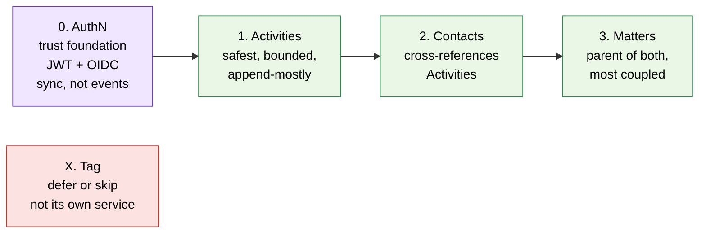
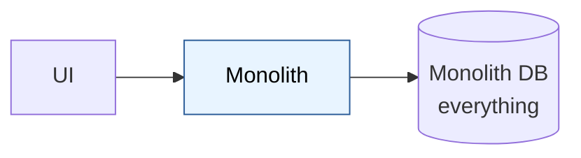
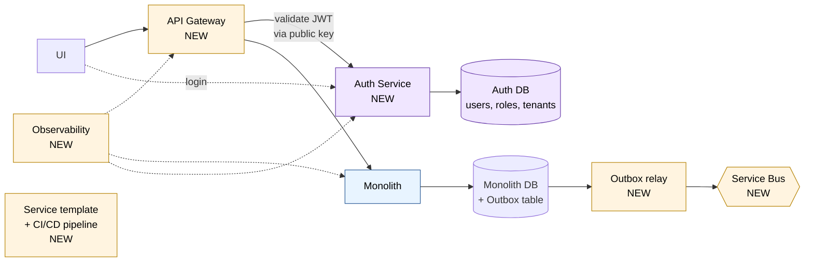
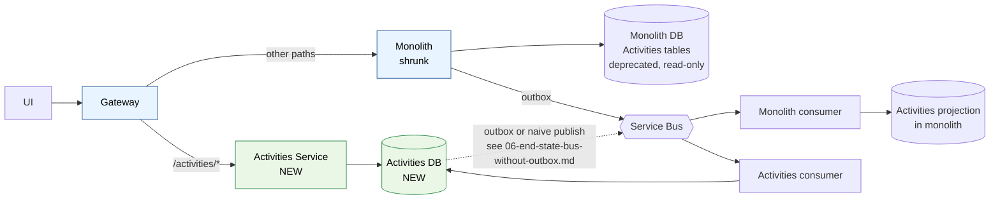
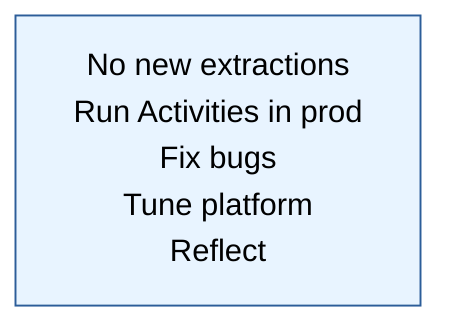
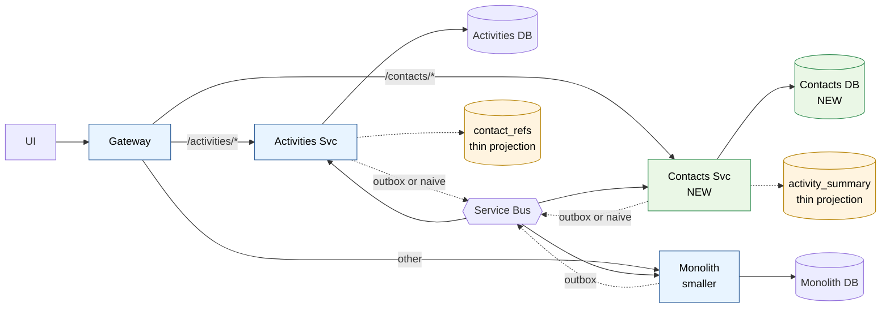
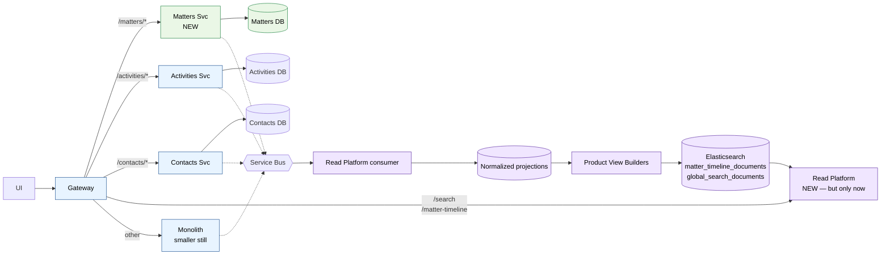
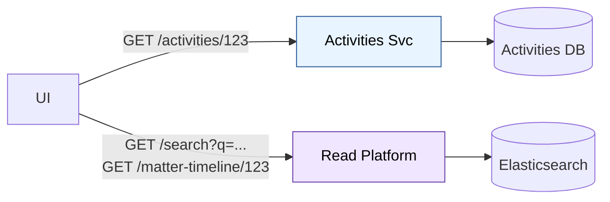
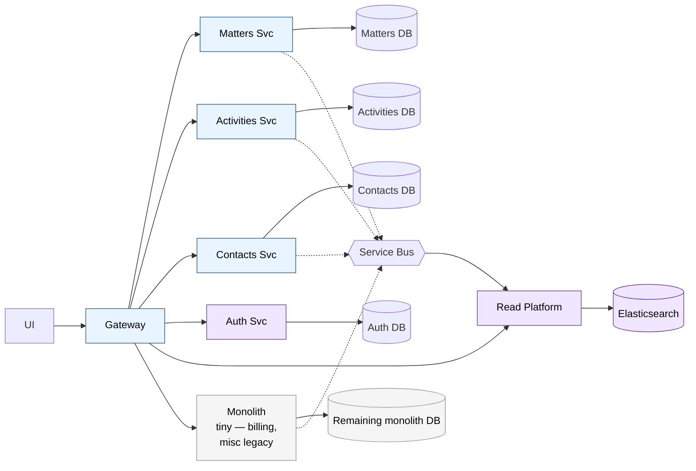
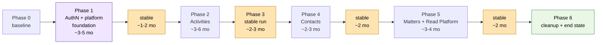

# Migration Plan — Adapting the Customer's Architecture

The customer's diagram is a coherent **end-state**. This doc is the **path** to get there safely: one service at a time, monolith coexisting, deferring complexity until it's earned.

The plan has three parts:

1. **Reframing** — what to change in their design before you start.
2. **Order of extraction** — which service first, second, third, and why.
3. **Phase-by-phase migration** — six phases with diagrams, each leaving the system production-stable.

## Part 1 — Reframing: changes to request from the customer

Before any code, push back on these eight things:

| # | Their design | Recommended change | Why |
|---|---|---|---|
| 1 | Five services in parallel | One service at a time, 2–3 month stability gate between each | Inter-service issues debugged in N places simultaneously is unmanageable; first extraction validates the platform |
| 2 | Diagram shows only end-state | Add transitional diagrams at +3, +9, +18 months including monolith | Without a migration view, it's a rewrite not a strangler fig |
| 3 | Shared Read/Search Platform from day 1 | Per-service read APIs first; introduce the shared platform only when ≥3 services exist and cross-cutting search becomes a real need | Centralizing reads recreates the monolith bottleneck; defer until earned |
| 4 | Elasticsearch is the only read store | ES for **search & lists**; service-owned DB for **read-by-id / read-your-writes** | ES has refresh lag; users expect "I just created it, show me back" to work |
| 5 | Auth/Permissions via projection events, extracted last | Extract **Authentication first** (Phase 1, the trust foundation). Use **synchronous + JWT**, not events. Keep **Authorization distributed** (each service owns its own policy) | Auth is the foundation everything else stands on; doing it last forces every prior extraction onto the wrong auth pattern; revocations must be immediate (no projection lag) |
| 6 | Tag Service as its own service | Tags as a shared library or column on owning entities; re-evaluate at +18 months | Over-decomposition; tags are cross-cutting and small; not worth a service |
| 7 | "Ops Tooling" as a bullet point | Treat replay/backfill/reindex/alias-swap as a named 2–3 quarter workstream | Otherwise it gets done in a panic during the first incident |
| 8 | No write APIs visible | Draw the write paths explicitly, including cross-service writes (sagas) | Cross-service write coordination is the hardest part; can't ignore it |

After these changes their picture becomes **achievable** rather than aspirational.

## Part 2 — Order of extraction

Five candidates (Activity, Contact, Matter, Tag, User/Auth). Sequencing:

Reasoning:

- **AuthN first (the foundation)** — every subsequent service needs to validate tokens; doing it last forces every prior extraction onto a temporary auth pattern, then a retrofit. JWT/OIDC pattern is mature and vendor solutions exist. Synchronous, not event-driven. See Phase 1 below for the extraction mechanics.
- **Activities first domain service** — bounded, mostly append + read, eventual consistency acceptable, low blast radius. See `03-activities-extraction.md`.
- **Contacts second** — natural next domain; cross-references Activities (already extracted), so it exercises inter-service patterns from a known baseline.
- **Matters third** — parent aggregate referenced by both Activities and Contacts. Most coupled, so save for when patterns are proven.
- **Tag deferred or dropped** — make it a column or library. If a separate Tag service still seems necessary at month 18, revisit then.

**Authorization is not on this list.** AuthZ stays distributed: each service enforces its own access rules using claims from the JWT. No central permission projection. The monolith keeps its own AuthZ for the domains still inside it; each extracted service brings its AuthZ rules with it.

## Part 3 — Phase-by-phase migration

### Phase 0 — Current state (monolith only)

Nothing to change. This is the baseline.

### Phase 1 — Auth + Platform foundation

This phase combines two things that have to land together: the platform (gateway, bus, observability, service template) and the first service (AuthN). They land together because the gateway needs an issuer to validate tokens against, and the service template needs a real reference implementation. Roughly **3–5 months**.

#### Sub-phase 1a — AuthN extraction (the trust foundation)

This is its own mini-strangler-fig, run inside Phase 1.

| Step | What happens |
|---|---|
| 1 | Stand up Auth Service. Could be built (IdentityServer/Duende) or vendor (Auth0, Okta, Azure AD B2C). |
| 2 | Migrate `Users`, `Roles`, `Tenants` tables to Auth DB (one-time migration; or run them as a view on the monolith DB during transition). |
| 3 | Auth Service starts issuing JWTs alongside the monolith's existing session mechanism. Both work in parallel. |
| 4 | Monolith adds a middleware that accepts JWTs (validates signature using Auth Service public key). Login still works the old way; JWTs work too. |
| 5 | Switch login UI to use Auth Service. Existing sessions continue until expiry. New logins issue JWTs. |
| 6 | After a soak period, remove the legacy session mechanism from the monolith. |

Key design constraints:

- **Short-TTL access tokens** (5–15 minutes) + refresh tokens with rotation. Bounds the worst-case revocation lag.
- **No permission claims in the JWT beyond `tenantId`, `userId`, `roles`** (high-level). Fine-grained permissions stay in each service. JWTs do not become a substitute for AuthZ logic.
- **Token revocation list** (e.g., Redis with TTL) for "log this user out everywhere now." Gateway checks the list on every request. Cheap because the list is small and short-lived.
- **No event-driven permission projection.** Period. Don't put AuthZ rules on the bus.

#### Sub-phase 1b — Platform foundation (concurrent or just after 1a)

- API Gateway in front of monolith. Validates JWT via Auth Service's public key (JWKS endpoint). Passes claims through to the monolith.
- Service Bus deployed, topic naming conventions established.
- Outbox table + relay in the monolith. **Not publishing real events yet** — verified empty round-trip works.
- Observability stack (logs, metrics, distributed tracing) instrumenting the monolith, gateway, and Auth service.
- Service template repo (Dockerfile, health checks, structured logging, metrics, tracing, DB migrations, JWT validation middleware). The Auth service is the first instance of this template.
- CI/CD pipeline proven on the Auth service.
- On-call rotation extended; runbook template written.
- Schema/event versioning policy documented.

#### What customer sees at end of Phase 1

- New login flow (probably better UX — modern OIDC, SSO-ready, MFA-ready).
- No other functional changes.

#### Why this combined phase makes sense

- **The Auth service is the reference implementation of the platform.** Every later service is a clone of it. So building the platform without Auth means building it twice.
- **The Gateway needs JWT validation.** That needs Auth to exist.
- **Authentication is the most common single thing in any web app.** Getting it right early means every later service inherits a consistent identity model.
- **It's a real production deployment of a microservice.** Forces the team to learn the operational reality before doing it with business-critical domain data.

### Phase 2 — Activities extracted (the first slice)

Apply the 7-step rollout from `03-activities-extraction.md`. Roughly **3–6 months**.

Key choices to make during this phase:

| Question | Recommendation |
|---|---|
| Outbox or CDC or naive publish in Activities service? | **Naive publish + reconciliation** (see `06`). Cheapest. Upgrade later. |
| Per-service read API or push into a shared search platform? | **Per-service read API** for now. No shared platform yet. |
| Elasticsearch for Activities? | Only if Activities-grid needs full-text search. Otherwise the service's own DB is enough. |
| How does the monolith show activities on legacy screens? | Local projection updated from events (recommended) or sync calls to Activities API (simpler, more coupled). See `04` vs `05`. |

At the end of Phase 2:

- One service is in production.
- The platform's actually been used in anger.
- You've learned what your service template is missing.
- You have an opinion on outbox vs naive publish (informed, not theoretical).

**Hold here for 2–3 months.** Don't start Contacts until Activities is boring.

### Phase 3 — Stable run + retrospective

What "stable" means concretely:

- Activities service incident rate at or below monolith's baseline for that domain.
- Reconciliation job has caught zero meaningful drift for 30+ consecutive days.
- p99 latency for `/activities/*` endpoints stable and acceptable.
- Operating team has handled at least one Service Bus outage and one Activities DB failover.
- Schema has been evolved once (a real `v1 → v2` event migration done in production).

This is the **gate before the second extraction.** Resist business pressure to start Contacts before this gate is passed. The first extraction's instability becomes the second extraction's instability multiplied.

Retrospective deliverables:

- What in the service template is wrong / missing? Fix before cloning.
- What about the platform doesn't scale to N services? (Observability dashboards, alerting noise, on-call load.)
- Are there cross-cutting patterns that emerged that should be standardized now?
- What was over-engineered in Phase 1/2?

### Phase 4 — Contacts extracted (second service)

Now you find out whether your platform is actually a platform. See `07-second-extraction.md`.

What's genuinely new in Phase 4:

- **Inter-service interaction.** Activities subscribes to `ContactCreated/Updated/Merged` and keeps a `contact_refs` projection (just id + display_name + email). Contacts may or may not need a projection of Activities.
- **Saga consideration.** Operations that touch both services ("create activity for new contact") need a workflow design — usually choreography, sometimes a UI redesign to avoid atomicity.
- **Search across services.** "Search activities by contact name" now spans two services. Options: denormalize contact name into `contact_refs`, or introduce search platform (see Phase 5 decision).

What's reusable from Phase 2:

- Gateway routing (just add a path).
- Service Bus + topic conventions.
- Service template.
- CI/CD pipeline.
- Observability dashboards (clone with new service name).
- On-call playbook.

**Hold here for 2–3 months again** before the next extraction.

### Phase 5 — Matters extracted (third service) and the Read Platform decision

Matters is the parent aggregate. Once extracted, three services exist with cross-cutting query needs (e.g., "Matter Timeline" combining Matters + Activities + Contacts). This is where the customer's "Shared Read/Search Platform" idea becomes **legitimately** justifiable.

Key decision in Phase 5: **does the Read Platform get its own team, or is it a shared codebase owned by domain teams?**

- **Own team** = traditional platform team. Risk: becomes the new bottleneck.
- **Shared codebase + clear ownership rules** = domain teams contribute the projections they care about. Risk: lack of coherence, no one fixes cross-cutting bugs.

Either works. Pick deliberately and write down the decision.

**Critical rule:** the Read Platform is for **search and cross-domain views only**. It is *not* the primary read path. Read-by-id calls still go to the owning service:

This addresses the original concern (#4 in Part 1): ES is for search, not for read-your-writes.

### Phase 6 — End state (close to the customer's diagram, but honest)

Differences from the customer's original:

- **No Tag service.** Tags are a column or library.
- **Auth is synchronous + JWT**, not in the event projection path.
- **Read Platform serves search and cross-domain views only**; reads-by-id go to the owning service.
- **Monolith still exists** but is small — billing logic, miscellaneous legacy. Maybe extracted later, maybe not.
- **Per-service outbox is optional** depending on which pipe pattern was chosen per service (see `06`).

This is achievable in **18–24 months** for a team of moderate size. The customer's diagram-as-rewrite would take 24–36 months and fail at least once.

## Part 4 — Timeline overview

The yellow gates (stable run) are the most-skipped and most-important parts. They're where pressure mounts to "just start the next one." Don't.

Total: roughly **18–24 months elapsed**, with four production milestones (after AuthN, after Activities, after Contacts, after Matters) where business value is realized incrementally.

## Part 5 — What to tell the customer

Three-paragraph version, suitable for an architecture-review meeting:

> Your end-state design is sound in its CQRS structure, event discipline, and per-service write ownership. We agree with most of it. Our concern is that it's drawn as a destination, not a journey, and the journey is where the real risk lives. Extracting five services in parallel is unmanageable; the second extraction is where teams discover whether their platform actually works, and you only get that learning by going one at a time with stability gates between.

> We propose three concrete adjustments. First, extract Authentication first, as the trust foundation alongside the platform infrastructure — every subsequent service inherits a consistent identity model, and the Gateway can validate tokens without coupling to the monolith. Authorization stays distributed; each service enforces its own access rules using JWT claims. Second, sequence the domain extractions: Activities → Contacts → Matters, with 2–3 month stability runs between each. Third, defer the Shared Read/Search Platform until at least three services are in production; per-service read APIs are sufficient until cross-cutting search is a real (not theoretical) requirement.

> The remaining changes are smaller: drop the Tag Service in favor of a shared library or column; make Elasticsearch the search layer, not the primary read store; keep auth synchronous (JWT + short TTL + revocation list), never event-driven; and budget the ops tooling (replay, backfill, reindex, alias swap) as a named workstream rather than a checkbox. With these adjustments the same end-state is reachable in roughly 18–24 months, with the system running stably in production at every phase.

## Part 6 — Checklist for the customer

A short list of yes/no questions to flush out unstated decisions:

- [ ] Sequence: which service first? (Recommend: AuthN, then Activities.)
- [ ] Build AuthN in-house or vendor (Auth0, Okta, Azure AD B2C, IdentityServer/Duende)? (Recommend: vendor unless there's a specific reason not to.)
- [ ] JWT TTL + revocation strategy? (Recommend: 5–15 min access tokens, refresh with rotation, revocation list in Redis.)
- [ ] Where does AuthZ live? (Recommend: distributed — each service. Not a central projection.)
- [ ] What's the stability gate between extractions? (Recommend: 60–90 days, specific SLO targets.)
- [ ] Where do read-by-id requests go after extraction? (Should be: owning service.)
- [ ] Does the Read Platform exist in Phase 2? (Recommend: no.)
- [ ] Is Tag a service or a column? (Recommend: column or library, decide at +18 months.)
- [ ] Who owns the Read Platform — domain teams or a platform team? (Either, but write it down.)
- [ ] Cross-service writes (sagas) — choreography or orchestration? (Default: choreography.)
- [ ] Event versioning policy — additive-only, schema registry, contract tests? (All three.)
- [ ] Reporting/BI path — through ES or through a warehouse? (Recommend: warehouse via CDC from each service.)
- [ ] Ops tooling owner and roadmap? (Named workstream, not "the team will do it.")
- [ ] Rollback plan per phase? (Must exist before phase starts.)

## Summary

- **Their picture is the destination, not the route.** Add intermediate states.
- **AuthN first, as the trust foundation.** Phase 1, alongside the platform. Synchronous + JWT, never event-driven. Vendor solution acceptable.
- **AuthZ stays distributed.** Each service owns its own access rules; no central permission projection.
- **Then one domain service at a time with stability gates.** Activities → Contacts → Matters.
- **Defer the Read Platform until ≥3 services exist.** Per-service read APIs first.
- **Drop Tag Service.** Library or column.
- **ES for search; service DB for read-by-id.** Don't lose read-your-writes consistency.
- **Ops tooling is a real workstream.** Budget it explicitly.
- **18–24 months elapsed**, four production milestones along the way.

This gets you to (most of) the customer's end-state safely, with the system running every step of the way.
