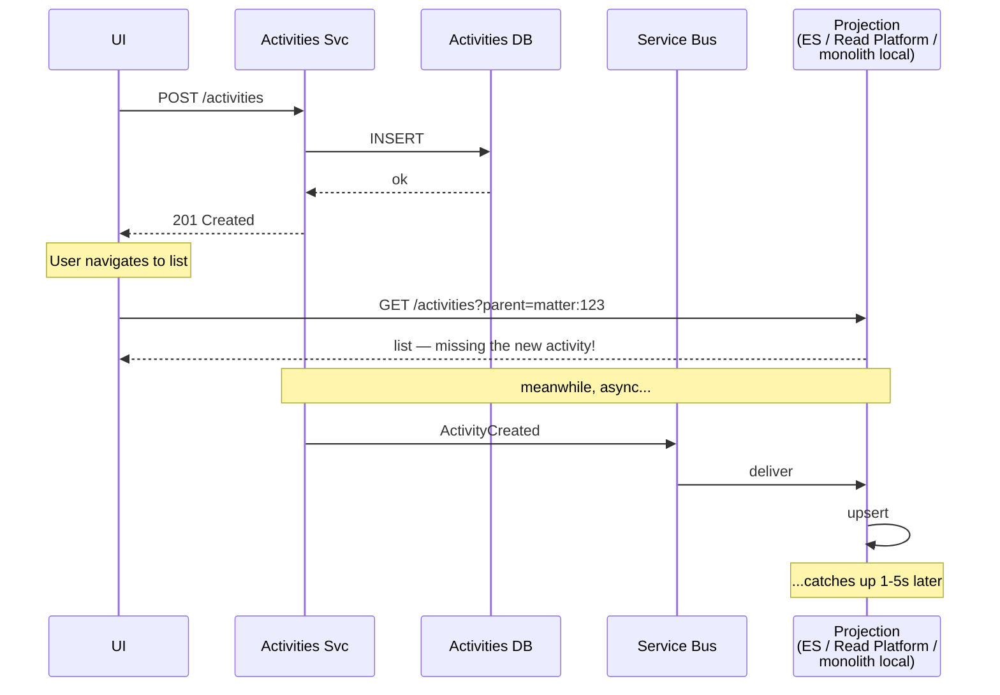
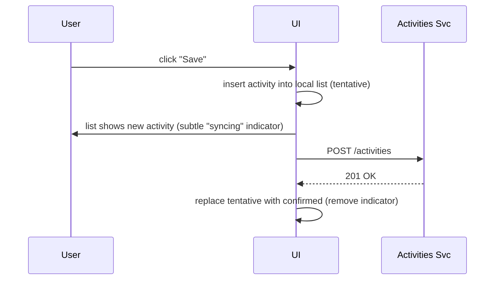
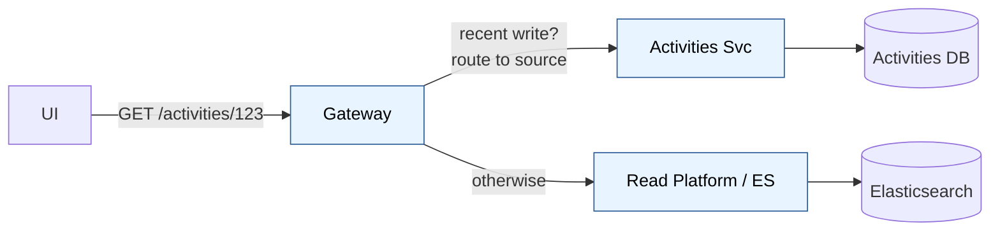
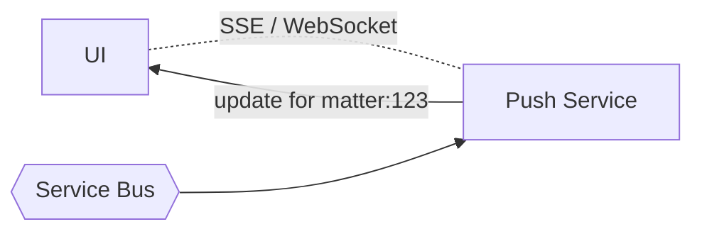
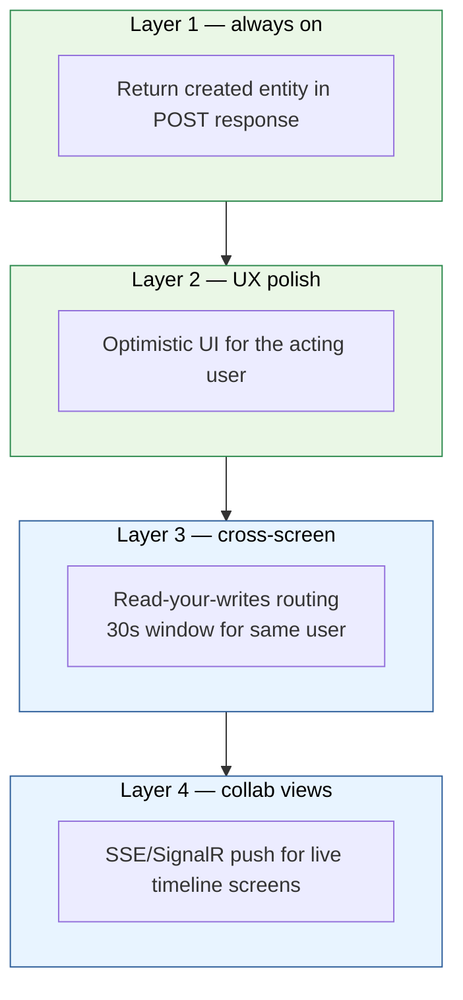
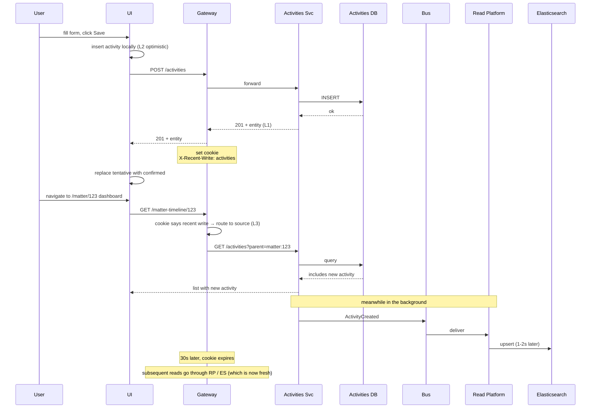

# Handling UI Staleness After Writes (Read-Your-Writes)

The problem: a user creates an activity, navigates to a list or timeline, and **doesn't see their own activity** for a few seconds because the list reads from a projection that hasn't caught up.

This is the most common UX complaint about CQRS/event-driven systems. It's also entirely solvable — there's no single fix, but layering 3–4 patterns makes the staleness invisible to users.

## Where the gap comes from



The window is typically **sub-second under healthy load**, but spikes to **5–30s** under load, ES refresh interval lag, or relay backpressure. Users notice anything over ~500ms.

## Pattern catalog

There are eight real patterns. Most apps use 3–4 layered together.

### Pattern 1 — Return the created entity in the POST response

**The single highest-leverage change.** If the POST response contains the full activity, the UI doesn't need to re-fetch.

```
POST /activities
→ 201 Created
  {
    "id": "...",
    "tenantId": "...",
    "parent": "matter:123",
    "type": "Note",
    "subject": "...",
    "createdAt": "2026-05-14T...",
    "createdBy": { "id": "...", "displayName": "..." }
  }
```

The UI takes that object and uses it directly — adds it to the local list, navigates to its detail page, whatever. No second round-trip.

**Cost:** zero. Just return what you wrote.
**Solves:** ~60% of read-your-writes UX problems on its own.
**When it doesn't help:** when the user navigates to a different screen that needs the activity included in an aggregate (e.g., "matter dashboard shows 47 activities").

### Pattern 2 — Optimistic UI updates

UI assumes the write will succeed, inserts the activity into the local view immediately, sends the request in the background. If the server rejects, undo locally with a toast.



Used by Slack, Linear, Notion, Trello. Feels instant. The risk is when the write fails — but you handle that case anyway (network errors, validation errors, permission errors).

**Cost:** UI state management for "tentative" entities; reconciliation logic on success/failure.
**Solves:** the perception problem completely for the *acting* user.
**When it doesn't help:** other users on other sessions seeing the same screen — they still depend on the projection catching up.

### Pattern 3 — Read-your-writes routing

After a write, route the user's subsequent reads to the **source service** (which has the data immediately), not the projection.



How to detect "recent write?":

- Set a short-lived cookie/header (`X-Activities-Recent-Write: <timestamp>`) after every successful write.
- Gateway sees the header → routes that user's `/activities/*` reads to the Activities Service for ~30 seconds.
- After the window, route resumes through the projection.

**Cost:** gateway logic; slight read load on the source service for ~30s after each write.
**Solves:** the case where the same user does write → read of related list.
**When it doesn't help:** cross-domain reads (matter timeline that includes activities).

### Pattern 4 — Causality tokens (write returns version, read waits)

Every write returns a version/sequence number. The UI passes it on subsequent reads. The projection-backed read API either:

- Serves the read if the projection is caught up to that version, OR
- Waits briefly (200–500ms) for the projection to catch up, then serves, OR
- Falls back to the source if it can't wait

```
POST /activities → 201
  Response header: X-Write-Version: 9876

UI then calls:
GET /matter-timeline/123
  Request header: X-Min-Version: 9876

Projection API:
  if (projection.version >= 9876) return result
  else wait up to 500ms, recheck
  else return result anyway (with X-Stale header)
```

Used in DynamoDB, Cosmos DB, some Kafka-based systems. Powerful, but complex.

**Cost:** projection has to track its own version per stream; APIs add wait logic; UI passes tokens.
**Solves:** cross-service reads with verifiable freshness.
**When it doesn't help:** when projection is far behind (you'd be waiting forever); fall back is still stale.

### Pattern 5 — Cache invalidation on write

If the UI or a CDN caches list responses, the write also pings an invalidation:

```
POST /activities → succeeds
  → also publishes: cache-invalidate(parent:matter:123, scope:lists)
  → CDN/UI cache drops that key
  → next list fetch goes through to the live service
```

Mostly useful when you have aggressive client-side caching or a read-through CDN. Doesn't help if the underlying projection is stale.

**Cost:** invalidation infrastructure (Redis pub/sub or similar).
**Solves:** stale client/CDN caches.
**When it doesn't help:** the projection itself being stale.

### Pattern 6 — Push updates (SSE / WebSocket / SignalR)

The UI subscribes to a stream of updates for the current view. When the projection commits, push to the subscribed UIs.



The UI doesn't poll — it reacts. New activities appear "live" in the timeline.

**Cost:** SignalR / WebSocket infrastructure; per-tenant fan-out; connection management.
**Solves:** other users seeing updates; live collaboration feel; long-lived dashboard views.
**When it doesn't help:** users on flaky mobile connections; first-load (you still need a baseline fetch).

### Pattern 7 — Pull-to-refresh / manual refresh

The UI doesn't try to be magic. The user pulls to refresh, or clicks "refresh." Honest, simple, often acceptable.

Combined with Pattern 1 (POST returns entity) and Pattern 2 (optimistic UI), this covers most real workflows. Users don't typically expect a list seven screens away to be perfectly in sync; they expect *the thing they just did* to be visible.

**Cost:** none.
**Solves:** "user explicitly wants fresh data."
**When it doesn't help:** users won't always remember/bother to refresh.

### Pattern 8 — Block the write until the projection catches up (anti-pattern, mostly)

Synchronous write → publish event → wait for projection ack → return 201 to user.

This guarantees consistency. It also defeats the entire point of CQRS: writes are now bounded by projection latency, throughput drops, the bus becomes a hard dependency for writes, and any consumer's slowness becomes the user's slowness.

**Use only in niche cases** where strict ordering is required on a critical screen and other patterns don't fit. Not as a default.

## Recommended stack for the Activities case

Layer four patterns. Each contributes a different piece:



| Layer | What it covers | Cost |
|---|---|---|
| 1. POST returns entity | The acting user's *immediate next action* (navigate to detail, edit, etc.) | Free |
| 2. Optimistic UI | The acting user seeing the activity in any list they happen to be on | UI state management |
| 3. Read-your-writes routing | The acting user navigating to other screens within ~30 seconds | Gateway logic |
| 4. SSE/SignalR push | Other users seeing the new activity live (e.g., shared matter dashboard) | Real-time infra |

Layers 1 and 2 are **non-negotiable** — every CQRS app needs them. Layers 3 and 4 are added when complaints justify them.

## Concrete recipes per UI screen

| Screen | Pattern stack |
|---|---|
| **"Log a call" form → success** | L1 (response has entity); UI navigates to activity detail using the response payload directly. No second fetch. |
| **Matter timeline (just created an activity, am viewing it)** | L2 (optimistic insert) + L3 (gateway routes my next /matter-timeline fetch to source for 30s). |
| **Matter timeline (someone else created activity)** | L4 (SSE push); fallback to projection. Staleness of 1–3s acceptable; "just now" indicator can hide it. |
| **Activity search results** | Accept short staleness; UI shows "Updated <time ago>" label; results from ES projection. Optionally L2 if I just created from this screen. |
| **Activity count on dashboard widget** | L2 optimistic increment client-side; reconcile on next page load. |
| **Activity detail view by id** | Source service direct (Activities Svc reads its own DB) — strong consistency, no projection involved. |
| **Activity feed in mobile app** | L1 + L2; SSE optional, often pull-to-refresh is fine. |
| **Reporting / BI screens** | Accept stale; show "Data as of <time>" clearly. Reports don't need second-level freshness. |

## A specific flow — "log a call, then view matter dashboard"

This is a common workflow that exercises multiple patterns:



The user never sees a stale view. The system was eventually consistent the whole time.

## Anti-patterns to avoid

- **Polling the projection from the UI after a write.** "Wait 2 seconds then re-fetch" is a bandaid that fails under load.
- **Synchronous projection.** Writing to ES inside the POST request. Couples write latency to projection latency.
- **Long projection-version waits inside read APIs.** "Wait up to 30 seconds for projection to catch up" turns slow projections into slow reads.
- **"Just make the bus fast enough."** The bus is always going to be at least 100s of ms slow. Solve the UX with patterns, not by tuning the pipe.
- **Showing "no data" when projection is empty for a just-created entity.** At minimum, fall back to source. Better: don't end up in that case.

## Failure modes specifically for these patterns

| Pattern | What can go wrong |
|---|---|
| L1 (entity in POST response) | None really. It's a free win. |
| L2 (optimistic UI) | Server rejects (validation, permission) — UI must undo cleanly with a clear error. Reconciliation logic if local state diverges from server. |
| L3 (read-your-writes routing) | Source service overloaded if many users write at once and read patterns are bursty. Gateway needs a circuit breaker → fall back to projection. |
| L4 (SSE/SignalR) | Connection drops; UI may miss events. Need a baseline re-fetch on reconnect. |

## Measuring this

Add telemetry:

- **Projection lag p50/p95/p99** — seconds between event publish and projection commit. Watch this dashboard.
- **Read-after-write detection rate** — how often does a read within 30s of a write hit a stale projection? (Sample by querying both source and projection and comparing.)
- **L3 routing hit rate** — what fraction of `/matter-timeline` requests are routed to source because of recent-write cookie?
- **User-reported staleness incidents** — track support tickets mentioning "I created X and it didn't show up." If this trends up, layers need adjustment.

## Summary

- **Read-your-writes is solvable with layered patterns, not a single trick.**
- **Always do L1** (return created entity). Free, biggest impact.
- **Almost always do L2** (optimistic UI). The acting user perception problem is mostly UI-layer.
- **Add L3** (read-your-writes routing) when complaints come in about navigating between screens.
- **Add L4** (SSE/SignalR) when live collaboration matters.
- **Avoid the anti-patterns:** synchronous projection, polling-after-write, "wait until consistent" inside APIs.
- **Measure projection lag.** If it spikes you'll know before users complain.

For Activities specifically: layers 1 + 2 handle ~90% of the perceived staleness for free. Layers 3 + 4 are added when justified by observed UX issues, not preemptively.
