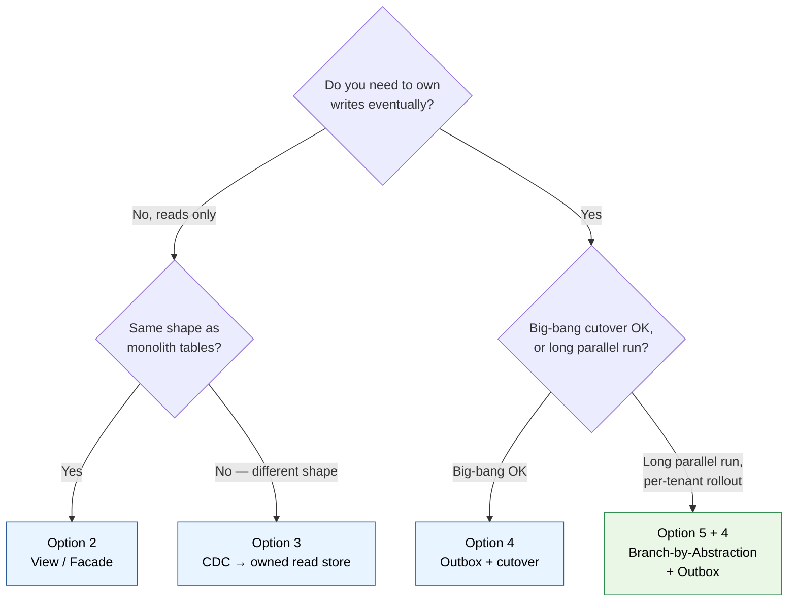

# Strangler Fig — Microservice Extraction Research

Research notes on extracting microservices from the monolith using the strangler fig pattern, with focus on data and database concerns. Activities is the first extraction candidate.

## Contents

1. [Options for data extraction](./01-options.md) — six approaches, when each fits, diagrams.
2. [Recommended approach: Branch-by-Abstraction + Outbox](./02-recommended-approach.md) — the default for ~80% of real extractions.
3. [Activities microservice — extraction plan](./03-activities-extraction.md) — concrete plan for the first slice.
4. [Full end-state picture (with outbox)](./04-end-state.md) — what the architecture looks like once Activities is fully extracted: UI calls Activities svc directly, both sides own their writes, peer-to-peer events via outbox + bus.
5. [End-state, Option 2 — without outbox](./05-end-state-without-outbox.md) — simpler infrastructure variant: synchronous service-to-service calls + periodic reconciliation. Trades decoupling for operational simplicity. Often the right starting point for a first extraction.
6. [End-state, Option 3 — Service Bus without outbox](./06-end-state-bus-without-outbox.md) — keeps async events on Azure Service Bus but drops the outbox table. Two practical patterns: CDC reading the SQL Server transaction log, or naive publish-after-commit + reconciliation job. Recommended sweet spot for first-extraction .NET/Azure work.
7. [The second extraction](./07-second-extraction.md) — what changes when you extract a second microservice after Activities: what gets reused, what's genuinely new (service-to-service interaction), how to pick the next candidate, what gets harder, traps to avoid.

## TL;DR

- **Default approach:** Branch-by-Abstraction + Outbox.
  - Branch-by-Abstraction = how requests choose old vs new path (the *switch*).
  - Outbox = how data reliably gets from monolith to new service (the *pipe*).
- **First candidate:** Activities. Bounded domain, mostly append + read, high volume but low per-record criticality, eventual consistency acceptable.
- **First slice (suggested):** reads only, then one activity type at a time, then write flip.
- **Each cutover step is a flag flip, not a deployment.** Reversible at every phase.

## Decision tree

